# Phrabbit 사용 설명서

A/B 구간 반복으로 외국어를 연습할 수 있는 iOS 앱입니다. 오디오 파일을 불러와 파형 위에서 원하는 구간을 자유롭게 반복하고, 음성을 자동으로 텍스트로 변환해 함께 보면서 학습할 수 있습니다.

---

## 목차

1. [시작하기](#1-시작하기)
2. [홈 화면](#2-홈-화면)
3. [파일 불러오기](#3-파일-불러오기)
4. [플레이어 — 기본 재생](#4-플레이어--기본-재생)
5. [A-B 구간 반복](#5-a-b-구간-반복)
6. [북마크](#6-북마크)
7. [음성→텍스트(STT) 변환](#7-음성텍스트stt-변환)
8. [구간 직접 편집·추가](#8-구간-직접-편집추가)
9. [단어장](#9-단어장)
10. [팟캐스트](#10-팟캐스트)
11. [설정](#11-설정)
12. [무료 vs 프리미엄](#12-무료-vs-프리미엄)
13. [자주 묻는 질문](#13-자주-묻는-질문)

---

## 1. 시작하기

### 1-1. 첫 실행 — 온보딩
앱을 처음 실행하면 3장의 안내 슬라이드가 나옵니다.

1. **파형으로 정확하게 구간 선택** — 음성을 그래프로 보면서 원하는 부분을 짚을 수 있습니다.
2. **A/B 포인트로 무한 반복** — 시작점(A)과 끝점(B)을 잡으면 그 구간만 자동으로 반복됩니다.
3. **실시간 음성→텍스트 변환** — 듣고 있는 오디오를 자동으로 텍스트로 변환해 함께 볼 수 있습니다.

오른쪽 위 **"Skip"** 버튼으로 건너뛸 수 있고, 마지막 슬라이드의 **"Get Started"** 버튼으로 시작합니다.

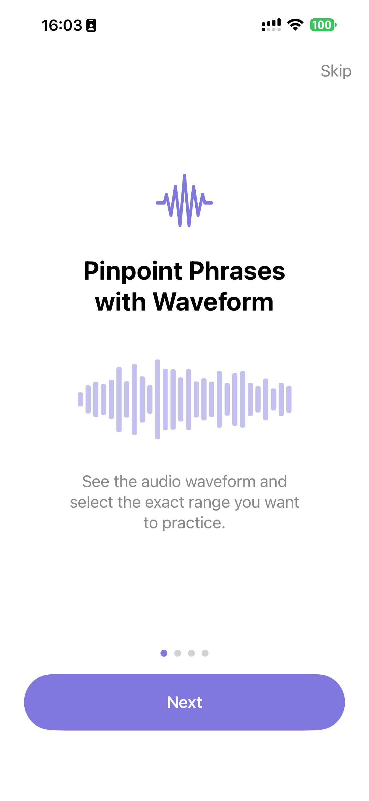
*▲ `images/01-onboarding.PNG` — 온보딩 첫 슬라이드(파형 애니메이션 포함)*

### 1-2. 무료 체험
첫 실행 시 자동으로 **3일 무료 체험**이 시작됩니다. 3일 동안은 모든 기능을 자유롭게 써볼 수 있습니다. 체험 기간이 남아 있는 동안 플레이어 위쪽에 주황색 배너로 **"🎁 Trial — D-N"** 이 표시됩니다.

---

## 2. 홈 화면

앱의 메인 화면입니다. 추가한 모든 오디오 파일이 여기 모입니다.

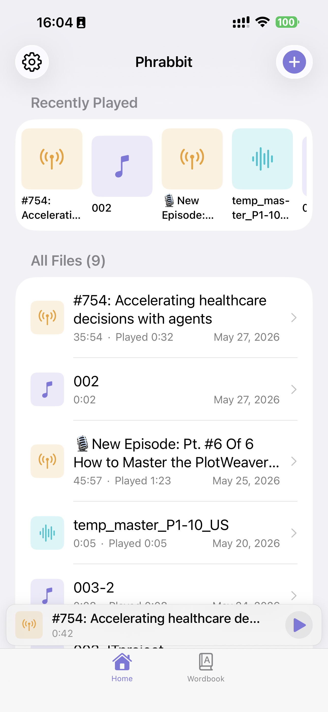
*▲ `images/02-home.PNG` — 홈 화면 전체(상단 검색바 + 최근 재생 가로 스크롤 + 전체 파일 목록 보이게)*

### 2-1. 화면 구성

| 위치 | 요소 | 설명 |
|---|---|---|
| 왼쪽 위 | ⚙️ 톱니바퀴 | 설정 화면 열기 |
| 오른쪽 위 | ➕ 보라색 원 | 파일 추가 메뉴 |
| 상단 | 🔍 검색창 | 파일 이름으로 검색 |
| 중앙 위 | "Recently Played" | 최근 재생한 5개 파일 (가로 스크롤) |
| 중앙 | "All Files (개수)" | 전체 파일 목록 |

### 2-2. 파일 행 보는 법
각 파일의 왼쪽 아이콘 색상으로 출처를 구분할 수 있습니다.

- 🟦 **청록 파형 아이콘** — 파일 앱에서 가져온 로컬 파일
- 🟪 **보라 음표 아이콘** — 뮤직 라이브러리에서 가져온 곡
- 🟧 **주황 안테나 아이콘** — 팟캐스트 다운로드

아이콘 오른쪽에는 파일 제목, 총 재생 시간, 마지막 재생 위치(있을 때), 추가 날짜가 표시됩니다.

### 2-3. 동작

- **파일 한 번 탭** → 플레이어 열림
- **파일을 왼쪽으로 스와이프** → 빨간 🗑 **Delete** 버튼이 나타나며, 누르면 파일·파형 캐시·구간 데이터가 모두 함께 삭제됩니다.

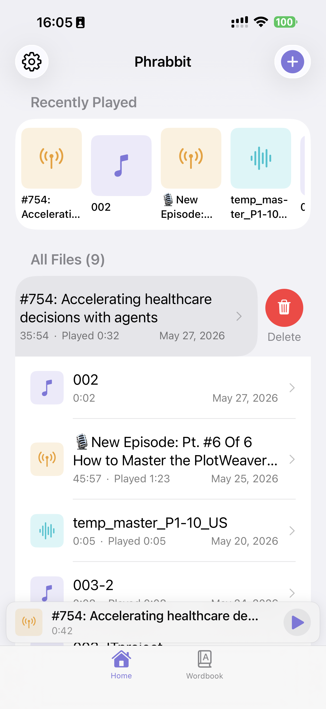
*▲ `images/03-home-swipe-delete.PNG` — 파일 행을 왼쪽으로 스와이프해서 빨간 Delete 버튼이 보이는 상태*

---

## 3. 파일 불러오기

홈 화면 오른쪽 위 **➕ 버튼**을 누르면 메뉴가 펼쳐집니다.

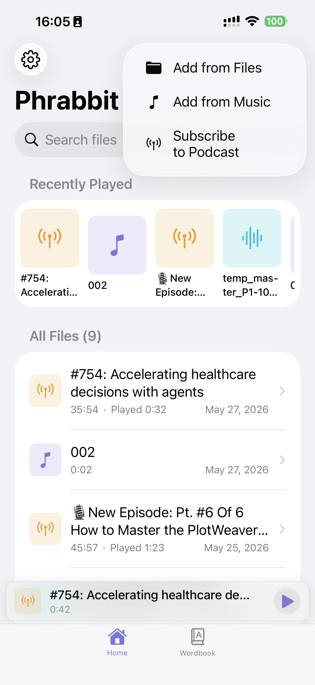
*▲ `images/04-add-menu.PNG` — ➕ 버튼을 누른 뒤 펼쳐진 메뉴(Add from Files / Add from Music / Subscribe to Podcast)*

### 3-1. 파일 앱에서 추가
**Add from Files** → 시스템 파일 선택기가 열립니다. mp3, m4a, wav, aac 같은 오디오 파일을 골라 가져올 수 있습니다. 여러 개를 한 번에 선택해도 됩니다.

### 3-2. 뮤직 라이브러리에서 추가
**Add from Music** → 아이폰에 저장된 음악 목록이 열립니다.

- 🟢 **초록 체크 표시** — 이미 Phrabbit에 추가되어 있는 곡
- 🔒 **회색 잠금 + "DRM" 라벨** — Apple Music 구독으로 받은 곡(저작권 보호로 불러올 수 없음). 직접 구입했거나 CD에서 변환한 곡만 사용 가능합니다.

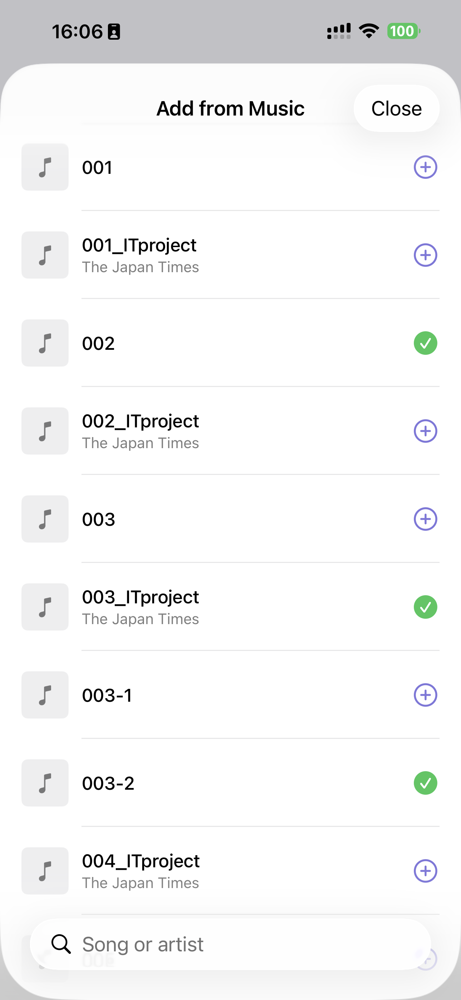
*▲ `images/05-music-picker.PNG` — 뮤직 라이브러리 선택 화면(초록 체크 + DRM 잠금 둘 다 보이게)*

곡을 탭하면 자동으로 m4a로 변환되어 Phrabbit에 추가되고, 곧바로 플레이어가 열립니다.

### 3-3. 팟캐스트 구독 (프리미엄)
프리미엄 상태에서는 **Subscribe to Podcast**를 누르면 Apple Podcasts 구독 목록이 보입니다.  
무료 상태에서는 안테나 아이콘 오른쪽 위에 🔒 잠금이 표시되며, 누르면 결제 안내 화면으로 이동합니다.

자세한 사용법은 [10. 팟캐스트](#10-팟캐스트)에 있습니다.

---

## 4. 플레이어 — 기본 재생

홈 화면에서 파일을 누르면 플레이어가 전체 화면으로 열립니다.

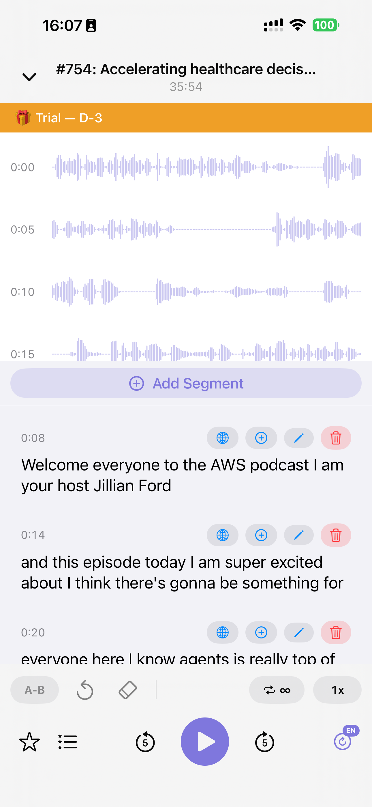
*▲ `images/06-player-main.PNG` — 플레이어 전체 화면(상단 ⌄ 버튼 + 파형 + A-B 정보 바 + 하단 컨트롤 + STT 텍스트 영역까지 한눈에 보이게)*

### 4-1. 화면 닫기 두 가지 방법

| 방법 | 설명 |
|---|---|
| 왼쪽 위 ⌄ 버튼 | 한 번 탭하면 플레이어가 내려가고 홈으로 돌아갑니다 |
| 위쪽에서 아래로 스와이프 | 손가락으로 헤더를 잡고 아래로 끌어내려도 닫힙니다 |

플레이어를 닫아도 재생은 계속됩니다. 화면 아래쪽에 **미니 플레이어**가 떠 있고, 이걸 탭하면 다시 플레이어가 열립니다.

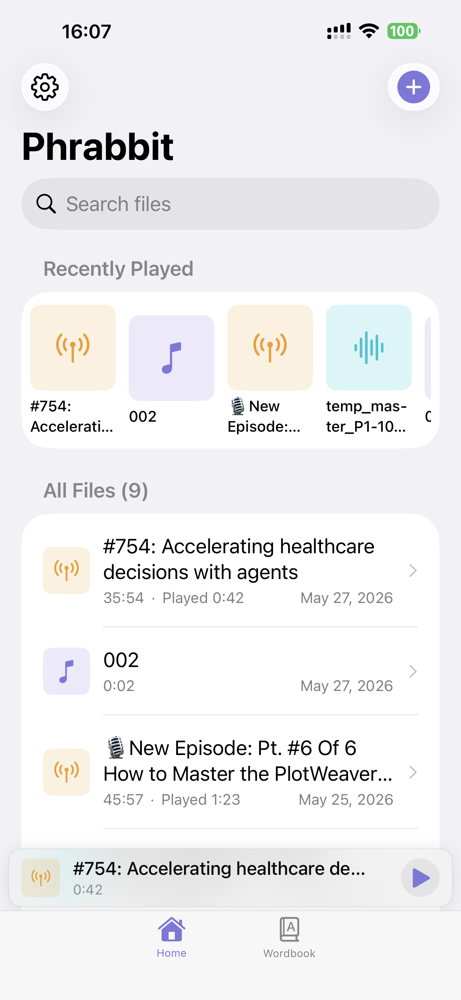
*▲ `images/07-mini-player.PNG` — 홈 화면 아래쪽에 뜬 미니 플레이어*

### 4-2. 파형 영역
시간 표시(예: `0:00`) 옆으로 5초 단위의 파형이 가로로 펼쳐지며, 재생 중에는 검은 세로선(재생 머리)이 따라 움직입니다. 화면도 재생 위치에 맞춰 자동으로 스크롤됩니다.

- **파형 한 번 탭** → 그 위치로 점프
- **파형 길게 누르기 (0.5초)** → A 또는 B 포인트 설정 ([5. A-B 구간 반복](#5-a-b-구간-반복) 참고)

### 4-3. 하단 컨트롤 — 윗줄

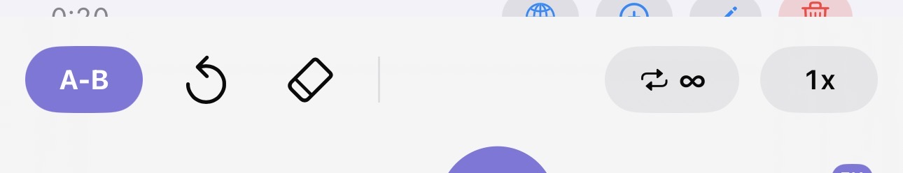
*▲ `images/08-controls-top-row.jpg` — 하단 컨트롤 윗줄만 확대(왼쪽부터 A-B / 되돌리기 / 지우개 / 구분선 / 반복횟수 / 재생속도)*

| 버튼 | 기능 |
|---|---|
| **A-B** 캡슐 | 탭으로 A→B 포인트 순서대로 설정 |
| ↶ **되돌리기** | 현재 A 포인트로 점프 |
| 🧹 **지우개** | A-B 구간 해제 |
| 🔁 **반복 횟수** | 탭할 때마다 ∞ → 1 → 2 → 3 → 5 → 10 → ∞ 순환 |
| **1x / 0.75x …** | 재생 속도 변경. 0.5 → 0.75 → 1 → 1.25 → 1.5 → 2 → 0.5 순환 |

### 4-4. 하단 컨트롤 — 아랫줄

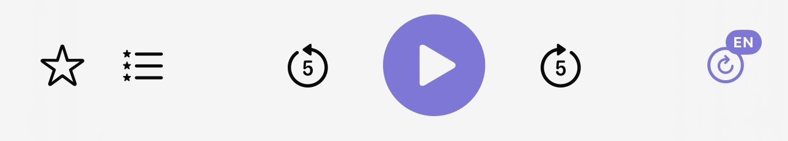
*▲ `images/09-controls-bottom-row.jpg` — 하단 컨트롤 아랫줄만 확대(왼쪽 별·목록 / 가운데 5초 뒤 ▶ 5초 앞 / 오른쪽 자막 마이크 버튼)*

| 버튼 | 기능 |
|---|---|
| ⭐ **별** | 현재 A-B 구간을 북마크로 저장 (프리미엄) |
| 📋 **목록** | 저장한 북마크 목록 열기 (프리미엄) |
| ⏪ **5초 뒤로** | 5초 되감기 |
| ⏯ **큰 재생 버튼** | 재생 / 일시정지 |
| ⏩ **5초 앞으로** | 5초 앞으로 |
| 💬 **자막 / 마이크** | 음성→텍스트 변환 (프리미엄) |

---

## 5. A-B 구간 반복

원하는 구간을 무한 반복하면서 듣고 따라할 수 있는 핵심 기능입니다.

### 5-1. A-B 버튼으로 설정 (가장 쉬운 방법)
하단 컨트롤 왼쪽 끝의 **"A-B"** 캡슐 버튼을 한 번 탭하면 현재 재생 위치가 A로 설정됩니다. 다시 탭하면 그 시점이 B로 설정되고, 즉시 반복이 시작됩니다.

상태에 따라 캡슐의 모양이 바뀝니다.

| 상태 | 캡슐 표시 |
|---|---|
| 아직 A 설정 전 | 회색 **"A-B"** |
| A만 설정됨 | 보라색 외곽선 **"A→B"** (B를 기다리는 중) |
| A·B 모두 설정 | 보라색 채움 **"A-B"** (반복 중) |

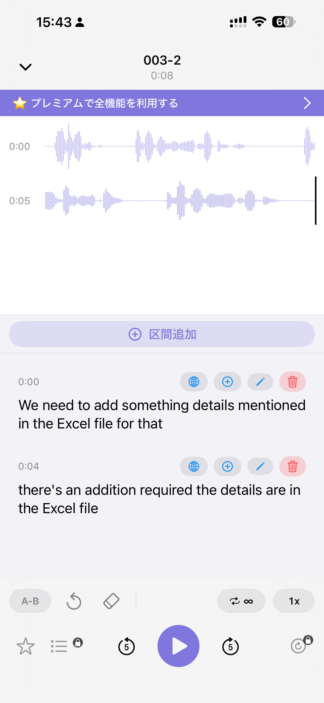
*▲ `images/10a-ab-none.PNG` — 회색 "A-B" (아직 A 설정 전)*

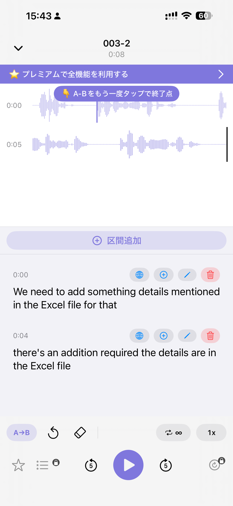
*▲ `images/10b-ab-waiting.PNG` — 보라색 외곽선 "A→B" (B를 기다리는 중)*

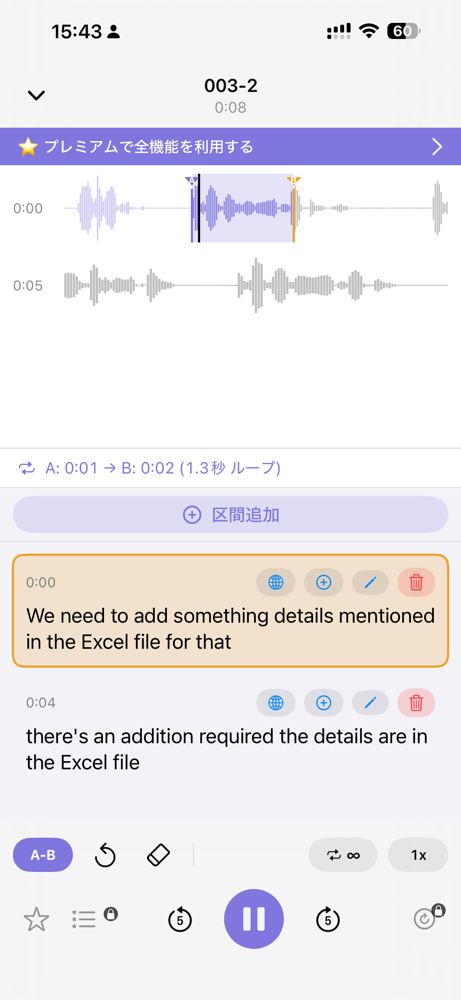
*▲ `images/10c-ab-active.PNG` — 보라색 채움 "A-B" (A·B 모두 설정, 반복 중)*

A만 설정된 상태에서는 파형 위에 **"👇 Tap A-B again to set the end"** 라는 안내 말풍선이 잠시 떴다가 사라집니다.

### 5-2. 파형 길게 눌러서 설정 (정밀하게)
파형 위 원하는 지점을 **0.5초 길게 누르면** A 포인트가 잡힙니다. 다시 다른 지점을 길게 누르면 B 포인트가 잡히고 반복이 시작됩니다.

파형 위에는 **A 핸들(보라)** 과 **B 핸들(주황)** 이 표시되며, 손가락으로 드래그해서 위치를 미세하게 조정할 수 있습니다.

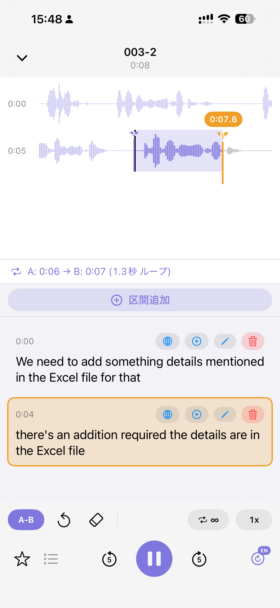
*▲ `images/11-ab-handles.PNG` — 파형에 A·B 핸들이 표시되고 그 사이가 보라색으로 강조된 상태*

### 5-3. A-B 정보 바
A-B 구간이 설정되면 파형 바로 아래에 보라색 글씨로 정보가 나타납니다.

```
🔁  A: 0:12 → B: 0:18 (6.0s loop)
```

### 5-4. 반복 동작과 조작

- **반복 횟수 버튼(🔁)**: 무한 반복(∞)이 기본값입니다. 횟수를 정하면 해당 횟수만큼 돌고 자동으로 멈춥니다.
- **되돌리기 버튼(↶)**: A 포인트로 즉시 점프합니다.
- **지우개 버튼(🧹)**: A-B 구간을 해제합니다.

---

## 6. 북마크

자주 연습하고 싶은 구간을 저장해 둘 수 있습니다. **프리미엄 기능**이며, 무료 사용자는 파일당 최대 3개까지 저장 가능합니다.

### 6-1. 저장
1. A-B 구간을 먼저 설정합니다.
2. 하단 컨트롤의 ⭐ **별 버튼**을 누릅니다.
3. 이름을 입력하고 **Save**를 누르면 저장됩니다.

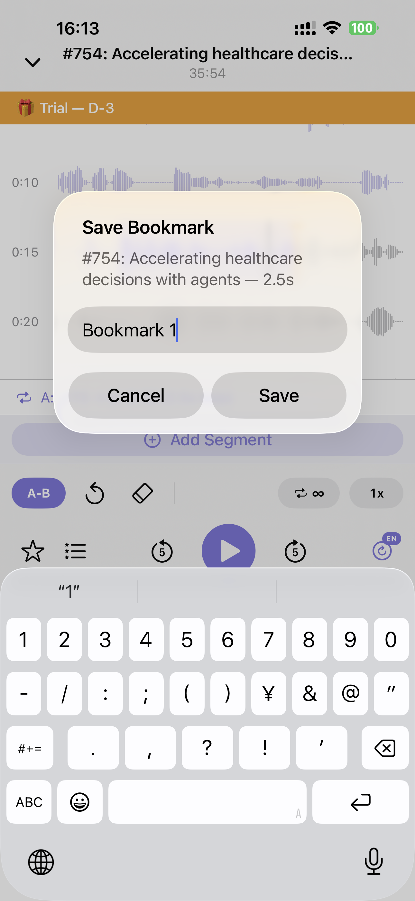
*▲ `images/12-bookmark-save.PNG` — 북마크 이름 입력 다이얼로그*

A-B 구간이 설정되지 않은 상태에서 별을 누르면 *"Set an A-B range first."* 알림이 뜹니다.

### 6-2. 목록에서 불러오기
별 옆의 📋 **목록 버튼**을 누르면 이 파일에 저장된 북마크 목록이 시트로 열립니다. 항목을 탭하면 그 A-B 구간이 자동으로 설정되고 바로 재생됩니다.

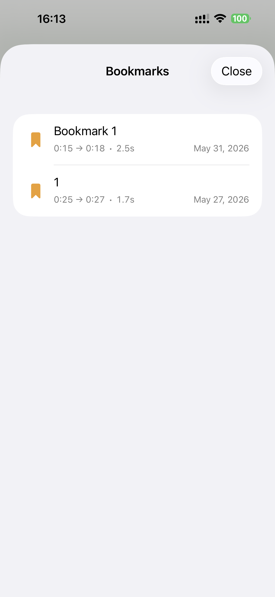
*▲ `images/13-bookmark-list.PNG` — 북마크 목록 시트*

목록에서 항목을 왼쪽으로 스와이프하면 삭제할 수 있습니다.

---

## 7. 음성→텍스트(STT) 변환

오디오를 자동으로 텍스트로 변환해, 듣는 동시에 글자로 확인할 수 있습니다. **프리미엄 기능**입니다.

### 7-1. 변환 시작하기
1. 플레이어 하단 오른쪽 **💬 자막 버튼**을 누릅니다.
2. 처음 사용할 때는 **언어 선택** 시트가 뜹니다. 영어, 한국어, 일본어 등 학습할 언어를 고릅니다.
3. **Done**을 누르면 변환이 시작됩니다.

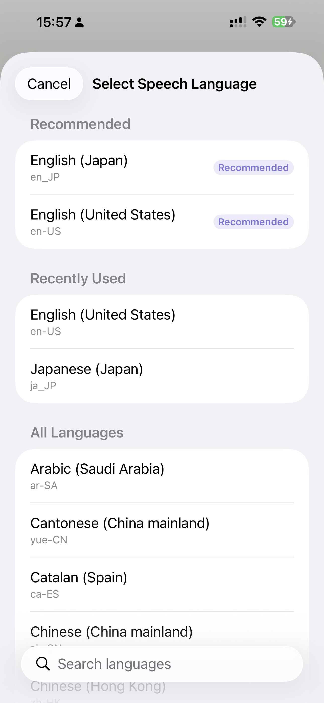
*▲ `images/14-stt-language.PNG` — STT 언어 선택 시트*

### 7-2. 변환 진행 상황
변환이 시작되면 자막 영역 위쪽에 진행 막대와 **"Converting…  N/총개수"** 표시가 나타납니다.

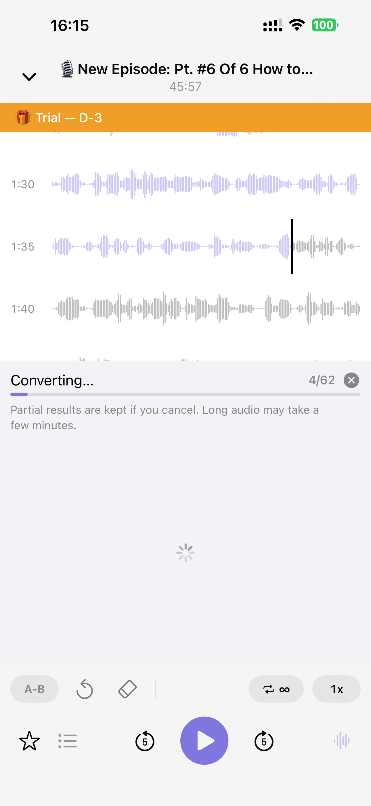
*▲ `images/15-stt-converting.PNG` — 변환 중 — 진행 막대 + Cancel 버튼이 보이는 상태*

- **45초 단위로 끊어서 처리**하기 때문에 긴 오디오일수록 시간이 더 걸립니다(1시간 분량은 몇 분 소요).
- 변환 도중 ❌ 버튼으로 **취소**할 수 있습니다. 중간까지 완료된 부분은 그대로 저장됩니다.
- 변환은 백그라운드에서 계속됩니다. 플레이어를 닫아도 멈추지 않습니다.

### 7-3. 변환된 텍스트 보기
변환이 끝나면 화면 아래쪽 자막 영역에 시간순으로 카드들이 나타납니다.

각 카드 구성:
- 시작 시간 (예: `0:32`)
- 출처 표시 (자동 생성은 표시 없음, 공식 자막은 ✅, 직접 편집한 건 🖊, 수동 입력은 📝)
- 인식 자신도가 낮으면 ⚠️ 주황 경고
- **본문 텍스트**
- 오른쪽 작은 버튼들: 🌐 번역 / ➕ 단어장 / ✏️ 편집 / 🗑 삭제

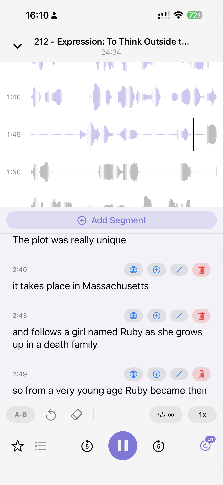
*▲ `images/16-transcript-cards.PNG` — 자막 카드 목록(여러 줄이 보이게, 현재 재생 중인 카드 하나는 주황 테두리)*

### 7-4. 카드 동작

- **카드를 탭하면** → 그 구간을 A-B로 잡고 즉시 반복 재생합니다.
- **🌐 번역**: iOS 17.4+ 기기에서는 시스템 번역 팝업이 뜹니다.
- **➕ 단어장**: 카드 안의 단어를 골라 단어장에 저장합니다 ([9. 단어장](#9-단어장)).
- **✏️ 편집**: 텍스트를 수정할 수 있습니다.
- **🗑 삭제**: 그 카드를 삭제합니다.

현재 재생 중인 카드는 **주황색 테두리**로 강조됩니다. A-B 구간 안에 들어 있는 카드들은 **연보라 배경**으로 표시됩니다.

### 7-5. 인식 못한 구간 — Gap 카드
30초 이상 인식 결과가 없는 구간은 회색 카드로 *"Could not recognize"* 라고 표시됩니다. **📝 Enter Manually** 버튼으로 직접 텍스트를 입력할 수 있습니다.

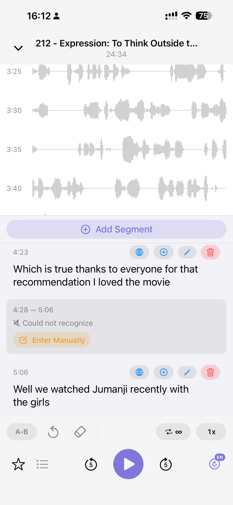
*▲ `images/17-gap-card.PNG` — Gap 카드 — "Could not recognize" + Enter Manually 버튼*

### 7-6. 다시 변환하거나 언어 바꾸기
이미 변환된 파일에서 💬 버튼을 누르면 메뉴가 뜹니다.

- **🔄 Re-run with current language** — 현재 언어로 다시 변환
- **🌐 Change Language and Re-run** — 언어 바꿔서 다시 변환
- **🗑 Clear Script** — 자동 생성된 자막만 삭제(직접 편집한 건 보존)

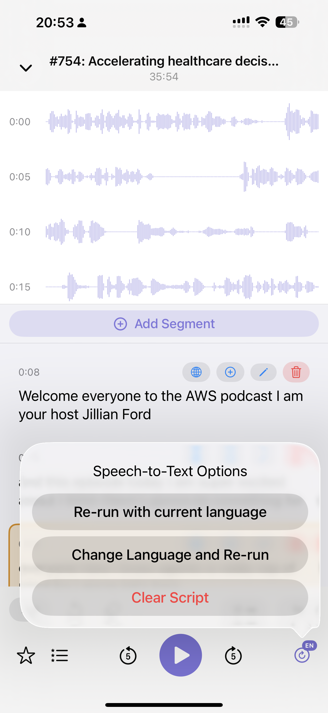
*▲ `images/18-stt-manage-menu.PNG` — STT 관리 메뉴(3개 옵션)*

> 💡 **팁**: 인식 결과 정확도가 너무 낮으면 "Speech recognition accuracy may be low" 알림이 뜹니다. 오디오의 실제 언어와 선택한 언어가 다를 때 자주 발생합니다. **Change Language** 버튼으로 바꿔서 다시 시도하세요.

---

## 8. 구간 직접 편집·추가

### 8-1. 자막 직접 추가
자막 영역 맨 위의 **➕ Add Segment** 버튼을 누르면 현재 재생 위치를 기준으로 새 구간을 만들 수 있습니다. 시트 안에서 텍스트를 입력하고 **Add**를 누르면 카드가 추가됩니다.

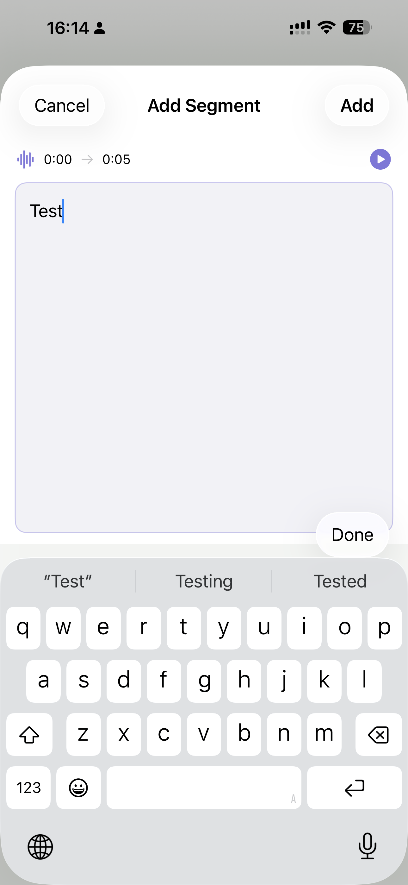
*▲ `images/19-add-segment.PNG` — Add Segment 시트(시간 범위 + 텍스트 입력 + ▶ 미리듣기 버튼)*

시트 안의 **▶ 미리듣기 버튼**을 누르면 해당 구간만 잠깐 들어볼 수 있습니다.

### 8-2. 자막 편집
카드의 ✏️ 버튼을 누르면 편집 시트가 열려 **자막 텍스트를 수정**할 수 있습니다. 위쪽 ▶ **Loop 버튼**으로 해당 구간을 반복해 들으면서 받아쓸 수 있고, STT로 만들어진 자막을 고친 경우 아래에 **Original**(원본)과 **Reset** 버튼이 나타나 언제든 원본으로 되돌릴 수 있습니다. (구간의 시간 범위는 여기서 바꿀 수 없으며, 상단에 참고용으로만 표시됩니다.)

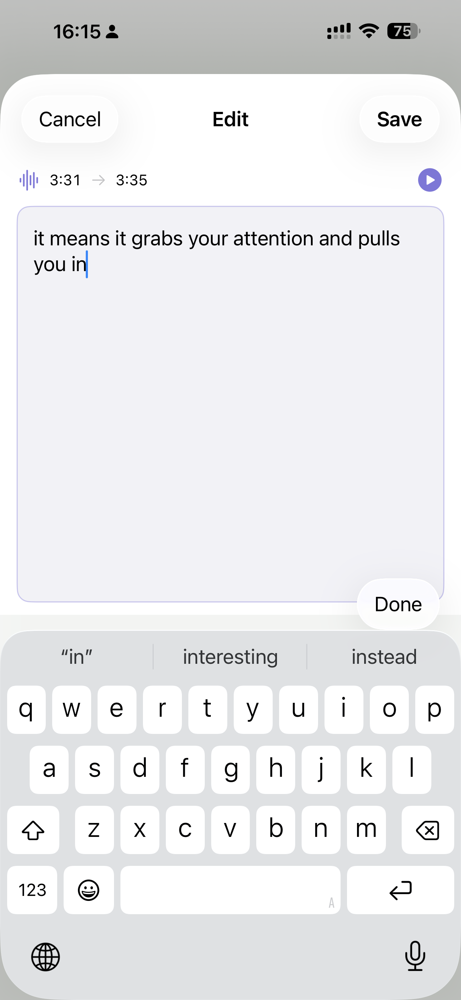
*▲ `images/19-edit-segment.PNG` — 자막 편집 시트(텍스트 수정 + Loop 미리듣기)*

---

## 9. 단어장

자막 카드에서 저장한 단어들이 모이는 공간입니다. **프리미엄 기능**입니다.

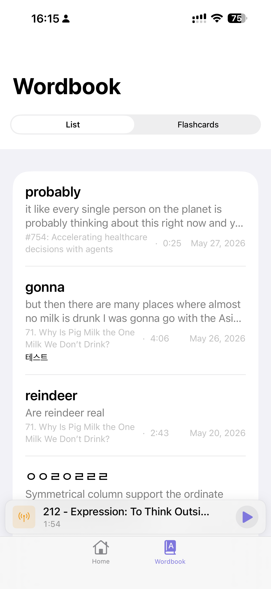
*▲ `images/20-wordbook-list.PNG` — 단어장 탭 — 단어 목록 모드*

### 9-1. 단어 저장하기
플레이어의 자막 카드에서 ➕ 버튼 → **단어 선택** 화면에서:

- 카드 본문에서 자동 추출된 단어들을 캡슐로 보여줍니다. 탭으로 고르거나, **Custom Input**에 직접 입력해도 됩니다.
- 메모를 적을 수 있습니다 (선택).
- **Save**를 누르면 단어장에 저장됩니다.

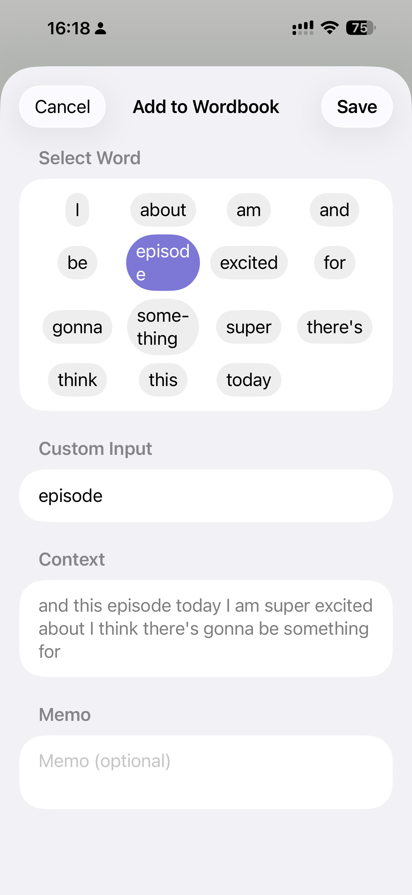
*▲ `images/20-wordbook-save.PNG` — 자막 카드에서 단어를 고르고 저장하는 화면*

### 9-2. 두 가지 보기 모드
화면 위쪽 세그먼트 컨트롤로 모드를 바꿉니다.

- **List** — 단어, 문장 컨텍스트, 출처 파일, 추가 날짜, 메모를 한눈에 볼 수 있습니다. 항목을 왼쪽으로 스와이프해 삭제할 수 있습니다.
- **Flashcards** — 카드를 탭하면 앞·뒷면이 바뀝니다(앞: 단어, 뒤: 문장+메모). 좌우로 스와이프해 다음 카드로 넘어갑니다.

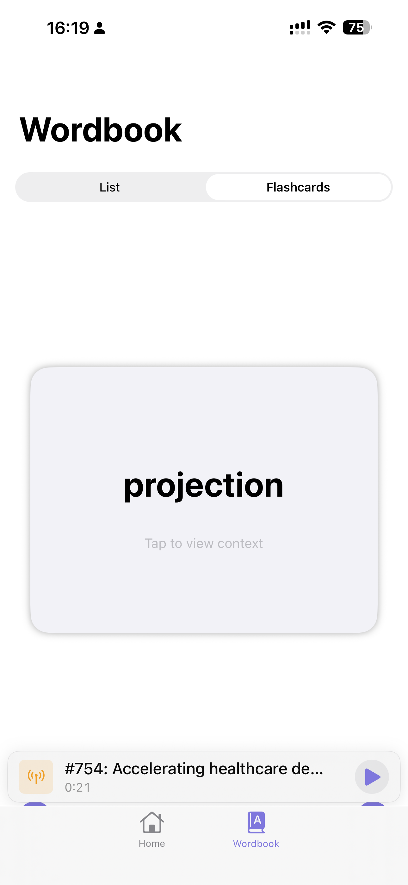
*▲ `images/21a-wordbook-flashcard.PNG` — 플래시카드 앞면(단어)*

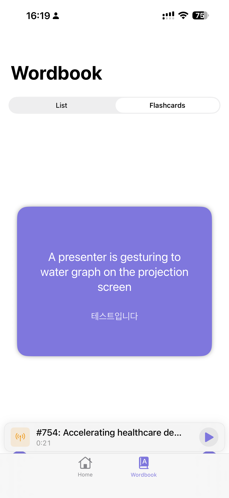
*▲ `images/21b-wordbook-flashcard.PNG` — 플래시카드 뒷면(문장 + 메모)*

---

## 10. 팟캐스트

Apple Podcasts에서 구독 중인 팟캐스트를 학습 자료로 가져올 수 있습니다. **프리미엄 기능**입니다.

### 10-1. 열기
홈 화면 ➕ 메뉴 → **Subscribe to Podcast**.

### 10-2. Apple Podcasts에서 가져오기
처음 사용할 때 **"Load from Apple Podcasts"** 버튼이 보입니다. 이걸 누르면 미디어 라이브러리 권한을 요청하고, 허용하면 구독 중인 팟캐스트들이 가로 스크롤 카드로 표시됩니다.


*▲ `images/22-podcast.PNG` — 팟캐스트 화면 — Apple Podcasts 구독 카드들이 가로로 스크롤되는 모습*

채널 카드를 탭하면 에피소드 목록이 시트로 열립니다.

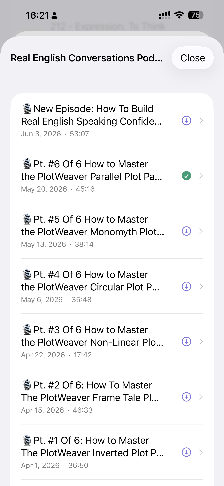
*▲ `images/23a-podcast-episodes.PNG` — 에피소드 목록 시트(공식 자막이 없는 일반 에피소드)*

각 에피소드:
- 제목, 발행 날짜, 길이
- **Script** 배지(보라) — 시간 정보가 있는 공식 자막을 제공하는 에피소드
- **Text only** 배지(회색) — 텍스트만 있는 에피소드
- 배지 없음 — 자막을 제공하지 않는 에피소드
- 오른쪽 상태:
  - ⬇ 다운로드 아이콘 — 받기 전
  - 🟣 진행 원 — 다운로드 중
  - ✅ 초록 체크 — 받기 완료

체크 표시된 에피소드를 탭하면 바로 플레이어가 열립니다.

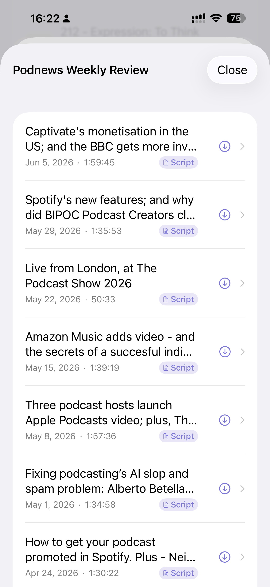
*▲ `images/23b-podcast-episodes-script.PNG` — 보라색 **Script** 배지가 붙은 에피소드 목록*

> 💡 **Script 에피소드를 추천하는 이유**: **Script** 배지가 있는 에피소드는 iOS 음성 인식(STT)으로 자막을 만들지 않고, **팟캐스트가 직접 제공하는 공식 자막을 그대로 가져옵니다**. 사람이 작성한 정확한 자막이라 STT보다 오타·오인식이 훨씬 적고, 변환을 기다릴 필요도 없습니다. 학습 자료를 고를 때는 Script 에피소드를 먼저 선택하는 걸 추천합니다.

### 10-3. RSS 주소로 직접 가져오기
화면 아래쪽 **"Add via RSS URL (advanced)"** 를 펼치면 RSS 주소를 직접 입력할 수 있습니다. Apple Podcasts에 없는 팟캐스트를 가져올 때 사용합니다.

### 10-4. 셀룰러 데이터 주의
기본 설정은 **Wi-Fi에서만 다운로드**입니다. 설정에서 셀룰러 다운로드를 허용한 경우, 큰 에피소드를 받기 전에 확인 알림이 뜹니다.

---

## 11. 설정

홈 화면 왼쪽 위 ⚙️ 톱니바퀴 아이콘으로 엽니다.

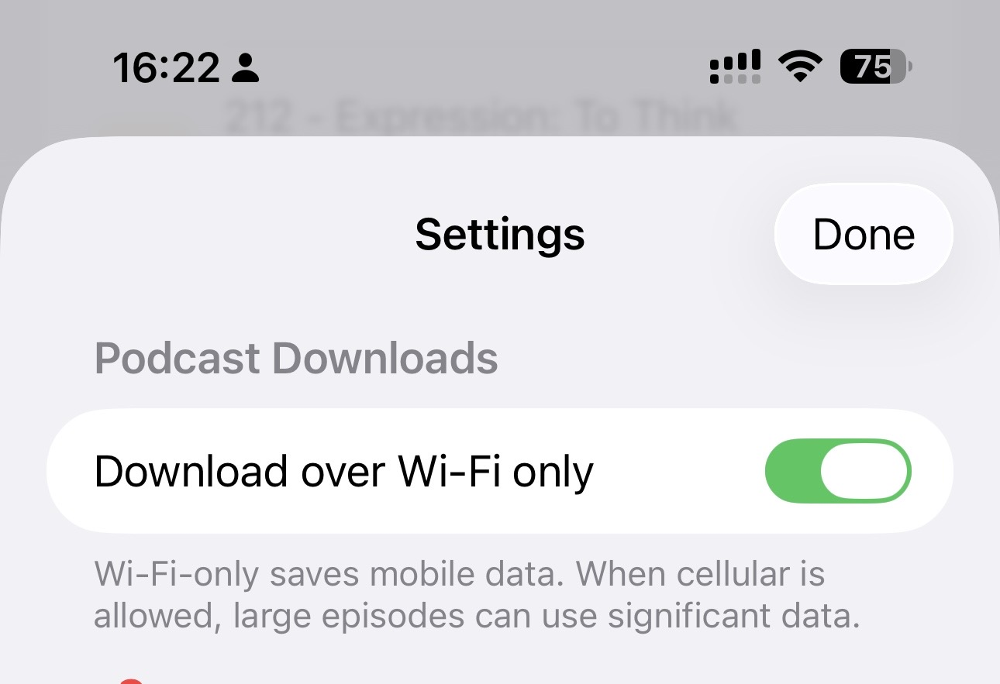
*▲ `images/24-settings.jpg` — 설정 화면*

### 11-1. 팟캐스트 다운로드
- **Download over Wi-Fi only** — 켜두면 Wi-Fi가 연결되었을 때만 받습니다(기본값: 켜짐).
- **Ask before cellular download** — Wi-Fi 전용을 끈 경우 표시되며, 셀룰러에서 받기 전에 매번 물어볼지 정합니다.

---

## 12. 무료 vs 프리미엄

### 평생 무료 기능
- 파형 보기 + A-B 구간 반복
- 재생 속도 조절
- 로컬 파일(Files 앱) 불러오기
- 뮤직 라이브러리 불러오기
- 북마크 (파일당 최대 3개)

### 프리미엄 기능
- 음성→텍스트 변환 (STT)
- 자막↔파형 실시간 연동
- 단어장
- 무제한 북마크
- 팟캐스트 다운로드

### 결제 방식
**3일 무료 체험 → 일회성 결제**입니다. 한 번 결제하면 평생 사용할 수 있고, 구독제가 아닙니다. 기기를 바꿔도 같은 Apple ID로 **"구매 복원"** 하면 그대로 이어집니다.

---

## 13. 자주 묻는 질문

**Q. Apple Music으로 들은 곡을 가져올 수 없는 이유가 뭔가요?**
A. Apple Music 구독으로 다운로드한 곡은 저작권 보호(DRM) 때문에 다른 앱에서 사용할 수 없도록 막혀 있습니다. iTunes Store에서 구매했거나 CD에서 변환한 곡만 가능합니다.

**Q. 음성 인식이 너무 부정확합니다.**
A. 두 가지를 확인해보세요. ① 오디오의 실제 언어와 선택한 언어가 같은지. ② 배경 음악이나 잡음이 많지 않은지. 인식이 너무 어려운 구간은 ➕ Add Segment 또는 Enter Manually 로 직접 입력하시면 됩니다.

**Q. 변환 중에 다른 파일을 누르면 어떻게 되나요?**
A. *"Switch to ...? Conversion will be interrupted. Partial results will be saved."* 라는 확인창이 뜹니다. 중간까지 완료된 부분은 그대로 보존됩니다.

**Q. 데이터가 인터넷으로 전송되나요?**
A. 아닙니다. Phrabbit은 외부 서버를 사용하지 않습니다. 음성 인식은 애플이 제공하는 단말 내부 기능을 사용하고, 단어장·북마크·자막은 모두 기기에 저장됩니다.

**Q. 기기를 바꾸면 내 자료는 어떻게 되나요?**
A. 현재 버전(v1.0)은 데이터를 기기 안에만 저장합니다. 새 기기에 앱을 깔고 같은 Apple ID로 **구매 복원**하면 프리미엄 잠금은 풀리지만, 단어장·북마크·자막은 옮겨가지 않습니다.

---

지원이 필요하면 앱 스토어 페이지의 개발자 연락처로 문의해주세요.
