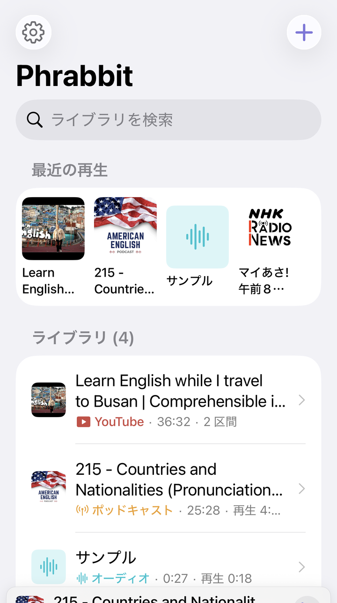
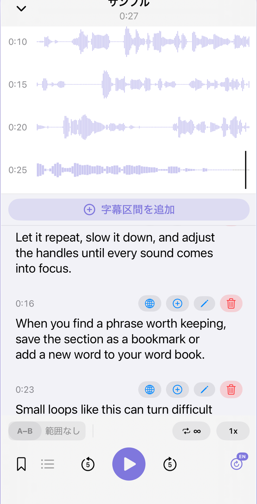
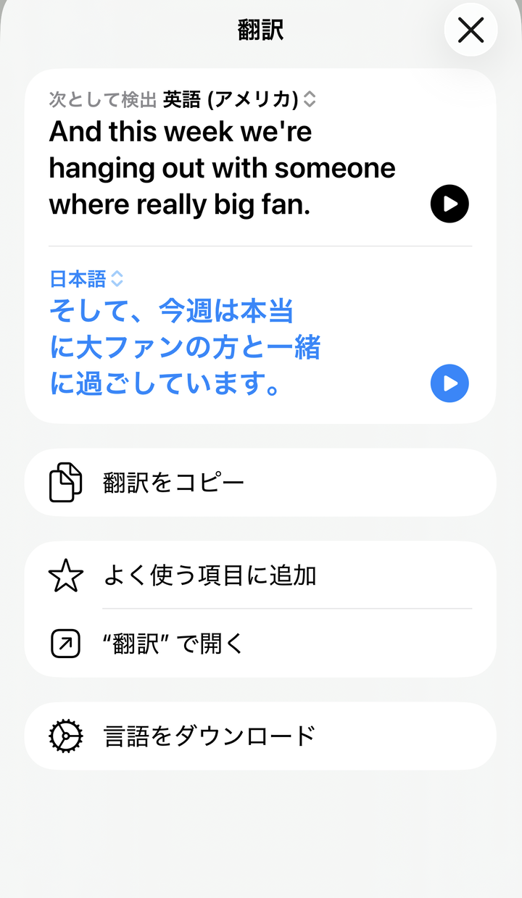
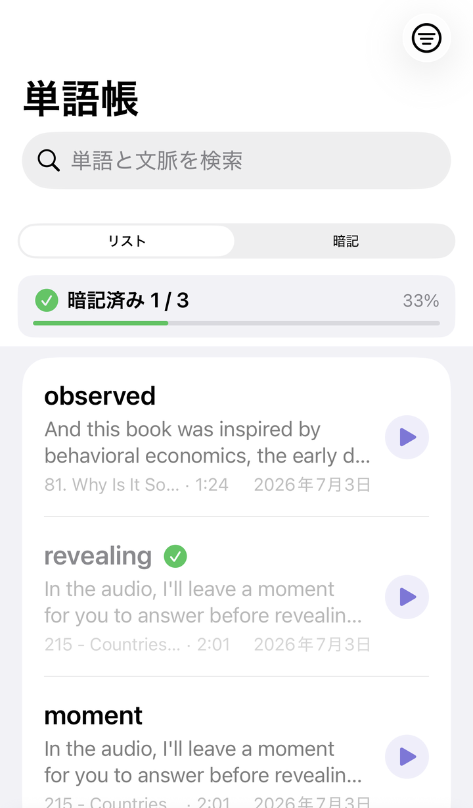
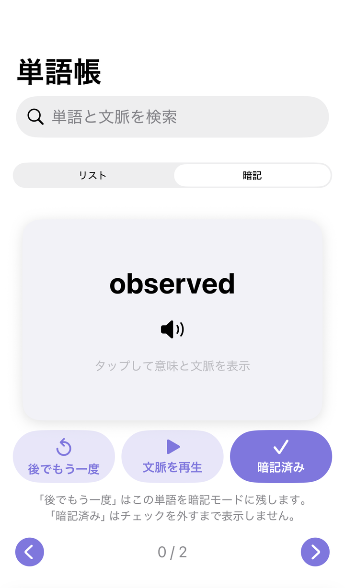
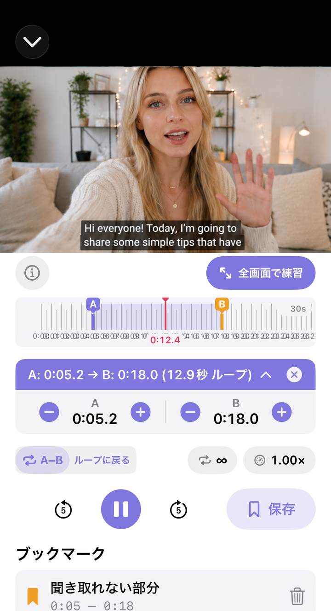
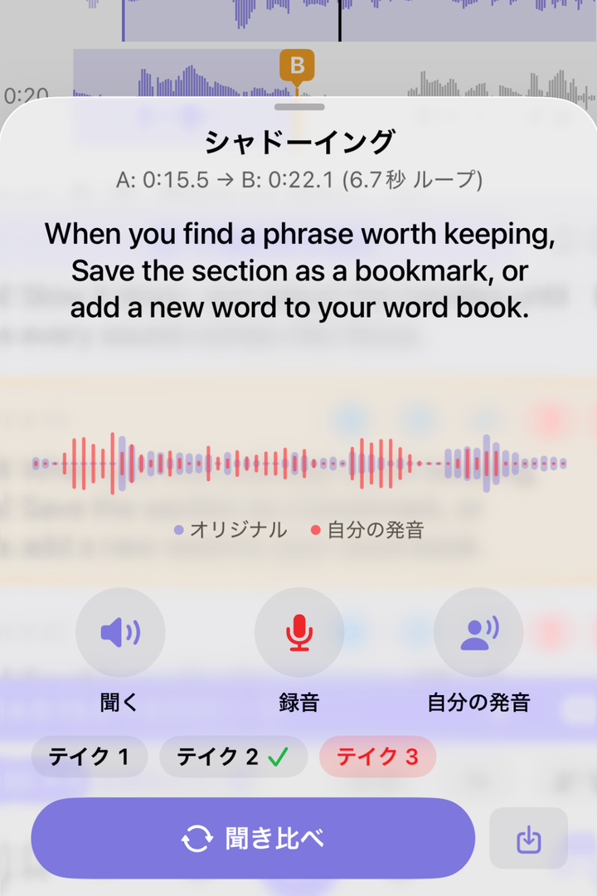
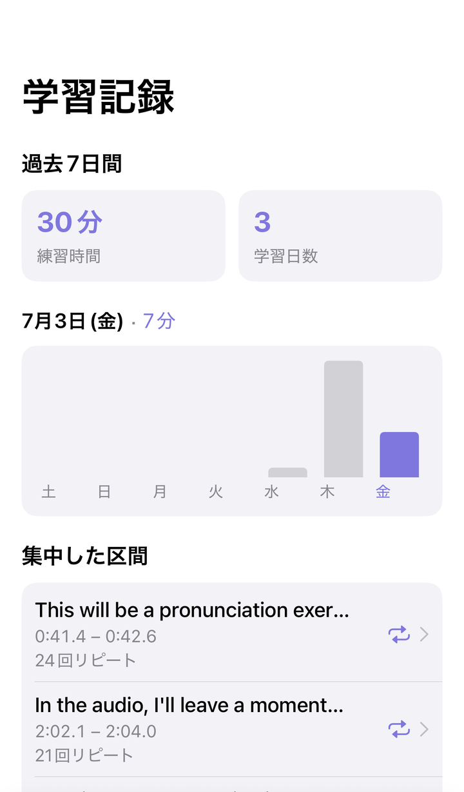

# Phrabbit ユーザーガイド

Phrabbit は、外国語のリスニング練習のための A/B 区間リピートアプリです。音声ファイル、ミュージックライブラリの曲、ポッドキャスト、YouTube リンクを学習素材として追加し、聞きたい区間だけを繰り返したり、自分の声でシャドーイング練習をしたりできます。音声テキスト変換、単語帳、シャドーイング録音、学習記録も利用できます。

> 注: このガイドのボタン名は、アプリ内の英語 UI を基準に記載しています。端末の言語設定によって、一部の文言は日本語で表示される場合があります。

## 目次

1. [はじめに](#1-はじめに)
2. [ホーム画面とライブラリ](#2-ホーム画面とライブラリ)
3. [学習素材を追加する](#3-学習素材を追加する)
4. [オーディオプレーヤー](#4-オーディオプレーヤー)
5. [A/B 区間リピート](#5-ab-区間リピート)
6. [ブックマークとリピート一覧](#6-ブックマークとリピート一覧)
7. [音声テキスト変換（STT）字幕](#7-音声テキスト変換stt字幕)
8. [字幕の編集、翻訳、手動追加](#8-字幕の編集翻訳手動追加)
9. [単語帳](#9-単語帳)
10. [YouTube ストリーム練習](#10-youtube-ストリーム練習)
11. [シャドーイング録音と比較](#11-シャドーイング録音と比較)
12. [ポッドキャスト](#12-ポッドキャスト)
13. [学習記録と設定](#13-学習記録と設定)
14. [無料版とプレミアム](#14-無料版とプレミアム)
15. [よくある質問](#15-よくある質問)

## 1. はじめに

### 1-1. 初回起動 - オンボーディング
アプリを初めて開くと、Phrabbit の基本的な流れを紹介する画面が表示されます。

1. **波形と A/B 区間リピート** - 音を目で見ながら開始点 A と終了点 B を指定し、その区間を繰り返します。
2. **字幕、単語帳、復習の流れ** - 字幕を読み、覚えたい単語を保存し、学習記録を積み重ねます。

最後の画面では、次のどちらかを選べます。

| ボタン | 説明 |
|---|---|
| **Try with a sample** | サンプル音声を開き、プレーヤーのチュートリアルを試します |
| **Skip** | すぐにホーム画面へ移動します |

### 1-2. 無料トライアル
オンボーディング後、**3日間の無料トライアル** が始まります。トライアル期間中はプレミアム機能を自由に試せます。トライアル中はプレーヤー上部に **Trial** バナーが表示され、タップするとプレミアム購入画面を開けます。

## 2. ホーム画面とライブラリ

ホーム画面は、追加した学習素材が集まる場所です。ローカル音声、ミュージックライブラリの曲、ポッドキャストエピソード、YouTube リンクが同じライブラリ一覧に表示されます。

*▲ ファイル、ポッドキャスト、YouTube をまとめて表示するホーム画面*

### 2-1. 画面構成

| 位置 | 要素 | 説明 |
|---|---|---|
| 左上 | 歯車 | 設定画面を開く |
| 右上 | プラスボタン | 学習素材の追加メニューを開く |
| 上部 | Search library | タイトルでライブラリを検索 |
| 中央上 | Recent | 最近練習した項目が 2 件以上あると表示 |
| 中央 | Library | すべての学習素材を表示 |
| 下部 | Home / Wordbook / Progress | ホーム、単語帳、学習記録タブ |

初回利用時やライブラリが空のときは、中央の **Add** ボタンからすぐに素材を追加できます。素材が 1 件以上になると、プラスボタンの位置を知らせる小さなヒントが一度表示されることがあります。

### 2-2. 項目の種類
一覧のアイコンやサムネイルで素材の種類を見分けられます。

- **波形アイコン** - ファイルアプリから読み込んだ音声
- **音符アイコン** - ミュージックライブラリから読み込んだ曲
- **アンテナアイコン** - ポッドキャストエピソード
- **YouTube サムネイルまたは再生アイコン** - YouTube ストリーム

項目をタップすると対応するプレーヤーが開きます。音声はオーディオプレーヤーで、YouTube は Stream プレーヤーで開きます。

### 2-3. 削除
項目を左にスワイプすると **Delete** が表示されます。削除すると、その素材に関連する波形キャッシュ、ブックマーク、字幕、保存済みシャドーイング録音も一緒に整理されます。保存済み録音がある項目では、削除前に確認画面が表示されます。

## 3. 学習素材を追加する

ホーム画面右上のプラスボタンをタップすると、追加メニューが開きます。

*▲ ファイル、音楽、YouTube リンク、ポッドキャストを追加するメニュー*

### 3-1. ファイルアプリから追加
**Add from Files** をタップすると、システムのファイルピッカーが開きます。mp3、m4a、wav、aac などの音声ファイルを読み込めます。複数ファイルを同時に選択することもできます。読み込んだファイルはアプリの Documents 領域にコピーされ、ライブラリに追加されます。

### 3-2. ミュージックライブラリから追加
**Add from Music** をタップすると、端末に保存されている音楽一覧が開きます。

- すでに Phrabbit に追加済みの曲にはチェックが表示されます。
- Apple Music サブスクリプションでダウンロードした曲は DRM のため読み込めません。
- 直接購入した曲や CD から変換した DRM なしの曲のみ使用できます。

曲をタップすると、アプリで再生できる形式に準備されたあとライブラリに追加され、そのままプレーヤーが開きます。

### 3-3. YouTube リンクを追加
**Add YouTube Link** をタップすると、YouTube リンク入力画面が開きます。

1. YouTube アプリまたはブラウザで動画の **Share** をタップします。
2. **Copy Link** をタップします。
3. Phrabbit に戻り、**Paste** をタップします。
4. サムネイルを確認し、**Add** をタップします。

動画ファイルはアプリ内に保存されません。リンク、再生位置、A/B ブックマーク、シャドーイング録音情報だけが保存され、動画は YouTube 埋め込みプレーヤーで再生されます。

### 3-4. ポッドキャストを追加
**Add from Podcast** はプレミアム機能です。プレミアムまたは無料トライアル中は、Apple Podcasts の購読一覧や RSS アドレスからエピソードを読み込めます。無料トライアル終了後はメニューにロックが表示され、タップするとプレミアム画面が開きます。

詳しくは [12. ポッドキャスト](#12-ポッドキャスト) を参照してください。

## 4. オーディオプレーヤー

ホーム画面で音声項目をタップすると、全画面プレーヤーが開きます。

*▲ 波形と文ごとのカードを同じ画面で表示するオーディオプレーヤー*

### 4-1. 閉じる操作とミニプレーヤー

| 方法 | 説明 |
|---|---|
| 左上の下向き矢印 | プレーヤーを閉じてホームへ戻ります |
| 画面上部から下へスワイプ | プレーヤーを手で下げて閉じます |

音声が読み込まれた状態でプレーヤーを閉じると、ホーム画面下部にミニプレーヤーが表示されます。ミニプレーヤーをタップすると、全画面プレーヤーに戻ります。

プレミアムユーザーが **Settings > Playback > Background playback** をオンにしている場合、画面ロック中やバックグラウンドでも音声を再生し続けられます。無料ユーザー、またはこの設定をオフにしているユーザーは、アプリがバックグラウンドへ移動すると音声が一時停止します。

### 4-2. 波形エリア
波形は音声を時間軸で表示します。黒い縦線は現在の再生位置で、再生中は画面が再生位置に合わせて動きます。

- **波形をタップ** - その位置へ移動
- **波形を長押し** - A または B ポイントを設定
- **A/B ハンドルをドラッグ** - 設定した区間を細かく調整

### 4-3. 下部コントロール

| コントロール | 機能 |
|---|---|
| **A-B** | 現在位置を A にし、もう一度押すと B に設定 |
| リピート回数 | 無限、または 1、2、3、5、10 回リピート |
| 再生速度 | 0.5x から 2x まで変更 |
| シャドーイング間隔 | A/B リピートの間に話す時間を入れるモード |
| ブックマークボタン | 現在の A/B 区間を保存 |
| リストボタン | 保存済みブックマークと My Recordings を開く |
| 5秒戻る/進む | 短く巻き戻し、または早送り |
| 再生ボタン | 再生と一時停止 |
| スリープタイマー | 5、15、30、60 分後に自動停止 |
| 字幕ボタン | 音声テキスト変換の開始または管理 |

スリープタイマーをオンにすると、ボタンに残り時間が表示されます。アプリを開いている間は無料ユーザーも使用でき、ロック画面で再生が続くかどうかはプレミアムのバックグラウンド再生状態によって変わります。

## 5. A/B 区間リピート

A/B 区間リピートは、聞きたい一文や短い表現を繰り返すための中心機能です。

*▲ 指先で A/B 区間を合わせて繰り返す画面*

### 5-1. A-B ボタンで設定
1. 繰り返したい開始位置で **A-B** をタップします。この位置が A になります。
2. 終了位置でもう一度 **A-B** をタップします。この位置が B になり、リピートが始まります。
3. 区間設定後に **A-B** をタップすると、A 位置へ戻ります。

状態によってボタンの見た目が変わります。

| 状態 | 意味 |
|---|---|
| A-B | まだ区間がありません |
| A→B | A のみ設定済み、B を待っています |
| 塗りつぶし A-B | A と B が設定され、リピート中です |

A のみ設定されている状態では、**Tap A-B again to set the end** という案内が表示されます。誤って A だけ設定した場合は、案内右側の閉じるボタンでキャンセルできます。

### 5-2. 波形で正確に設定
波形の任意の位置を長押しすると、A/B ポイントを設定できます。A と B のハンドルを指でドラッグして、位置をさらに細かく合わせられます。

### 5-3. A/B 情報バー
A と B が両方設定されると、波形の下に紫色の情報バーが表示されます。

情報バーでは次の操作ができます。

- 区間の長さを確認
- 情報バーをタップして A と B を少しずつ微調整
- マイクボタンでシャドーイング録音を開く
- 閉じるボタンで A/B 区間を解除

### 5-4. シャドーイング間隔
A/B 区間を設定すると、**person.wave.2** 形のボタンが表示されます。このボタンをオンにすると、リピートの間に短い無音時間が入り、直前に聞いた文を自分で言ってみることができます。録音しなくても使える無料の練習機能です。

無音時間中は **Speak** のカウントダウンが表示されます。

## 6. ブックマークとリピート一覧

ブックマークは、よく練習したい A/B 区間を保存する機能です。

### 6-1. ブックマークを保存
1. 先に A/B 区間を設定します。
2. 下部のブックマークボタンをタップします。
3. 名前を入力して **Save** をタップします。

名前を空のままにすると、ファイル名と区間の長さを基に自動で名前が作成されます。同じ区間を再度保存しようとしても、重複保存はされません。

### 6-2. ブックマーク一覧
リストボタンをタップすると、現在のファイルのブックマークが開きます。ブックマークをタップすると、その区間が A/B として復元され、すぐに練習できます。

*▲ 保存した A/B 区間と My Recordings をまとめて開く一覧*

ブックマークが 2 件以上あると、**Play All** メニューが表示される場合があります。複数のブックマークを順番に再生し、それぞれを 1、2、3 回ずつ繰り返すよう設定できます。

無料ユーザーは、オーディオファイルごとに新しいブックマークを 1 件まで作成できます。プレミアムまたは無料トライアル中は無制限に作成できます。プレミアムまたは無料トライアル期間中に保存したブックマークは、無料状態になったあとも一覧から開いて練習できますが、無料上限を超える新しいブックマークは追加できません。YouTube ストリームのブックマーク保存はプレミアム機能です。

## 7. 音声テキスト変換（STT）字幕

STT は、音声を文単位の字幕に変換する機能です。プレミアムまたは無料トライアル中に利用できます。

*▲ 音声を文単位の字幕カードに変換した画面*

### 7-1. 変換を開始
1. オーディオプレーヤー右下の字幕ボタンをタップします。
2. 初めて変換するファイルでは、言語選択画面が開きます。
3. 音声の実際の言語を選び、**Done** をタップします。

*▲ ファイル情報やタイトルを基におすすめ言語と最近使った言語を表示する画面*

言語のおすすめには、そのファイルで以前選んだ言語、ポッドキャスト RSS の言語情報、タイトルから検出した言語や文字種、端末の言語などが順番に使われます。最近使った言語は **Recently Used** に別で表示されます。おすすめが間違うこともあるため、実際の音声言語と合っているか確認してください。

すでに字幕があるファイルで字幕ボタンをタップすると、次のオプションが表示されます。

- **Re-run with current language** - 現在の言語でもう一度変換
- **Change Language and Re-run** - 言語を変更してもう一度変換
- **Clear Script** - 自動生成字幕を削除

字幕がない状態で字幕ボタンを長押しすると、変換前に言語を先に変更できます。

### 7-2. 変換中

変換中は **Converting...** または **Downloading language model...** の進行バーが表示されます。一部の言語では、初回利用時に端末内の音声モデルをダウンロードする場合があります。

*▲ 変換中は進行バーと、アプリを開いたままにする案内が表示されます*

重要な点:

- 変換中はアプリを開いたままにしてください。アプリを離れたり画面をロックしたりすると、変換が中断されることがあります。
- 長い音声は数分かかる場合があります。
- キャンセルすると今回の変換は中止され、既存の字幕は維持されます。
- モデルダウンロードや一部の復旧処理は Wi-Fi 設定の影響を受けます。

### 7-3. 変換結果を見る
変換が終わると、字幕カードが時間順に表示されます。

各カードには次の情報が表示される場合があります。

- 開始時刻
- 字幕の出所表示
- 信頼度が低い場合の警告
- **Approx. position** バッジ: テキストは認識されたが位置が概算の場合
- 字幕本文
- 翻訳、単語帳追加、編集、削除ボタン

字幕カードをタップすると、そのカードの区間が A/B に設定され、すぐにリピート再生されます。現在再生中のカードは強調表示され、A/B 区間内のカードは背景色が変わります。

### 7-4. 認識できなかった区間
無音または認識が難しい区間は **Could not recognize** カードとして表示される場合があります。この場合は **Enter Manually** で字幕を直接入力できます。

### 7-5. 字幕情報を見る
字幕エリアに情報ボタンが表示されている場合、変換日時、使用した認識エンジン、品質に関する案内を確認できます。自動字幕はどのモデルを使っても誤ることがあるため、重要な表現は自分で確認し、修正することをおすすめします。

## 8. 字幕の編集、翻訳、手動追加

### 8-1. 字幕を手動で追加
字幕エリア上部の **Add Segment** をタップすると、現在の再生位置を基準に新しい字幕区間を作成できます。テキストを入力して **Add** をタップするとカードが追加されます。

シート内の再生ボタンで、その区間をプレビューできます。

### 8-2. 字幕を編集
字幕カードの編集ボタンをタップすると、テキストを修正できます。STT で作成した字幕を編集した場合は元のテキストも表示され、必要に応じて **Reset** で戻せます。

### 8-3. 翻訳
字幕カードの翻訳ボタンをタップすると、iOS のシステム翻訳画面が開きます。翻訳は学習補助用であり、文脈によって不正確な場合があります。

*▲ 字幕の文をその場で翻訳して確認する画面*

### 8-4. 単語帳に追加
字幕カードのプラスボタンをタップすると、その文から単語や表現を選んで単語帳に保存できます。単語帳自体はプレミアム機能のため、無料トライアル終了後はプレミアム画面が開きます。

## 9. 単語帳

単語帳は、字幕カードから保存した単語や表現をまとめて復習する場所です。プレミアムまたは無料トライアル中に利用できます。

*▲ 文脈と一緒に表現を保存する単語帳*

### 9-1. 単語を保存
字幕カードのプラスボタンをタップすると、**Add to Wordbook** 画面が開きます。

保存できる内容:

- 単語または表現
- 意味
- 学習文脈
- 文脈翻訳
- メモ
- Apple Intelligence の説明

文から自動抽出された単語チップを選ぶか、**Custom Input** に直接入力できます。英語のようにスペースがある言語は単語単位で表示され、日本語や中国語はアプリが再度トークン化して、より自然な単位で表示しようとします。

*▲ 字幕文から単語を選び、意味と学習文脈を保存する画面*

### 9-2. Translate で入力
**Meaning** と **Context Translation** には **Translate** ボタンがあります。タップすると iOS 翻訳機能で意味や文脈翻訳を入力できます。結果は保存前に自分で修正できます。

iOS 翻訳機能は、音声の言語と端末の言語が同じ場合、別の翻訳を作成しないことがあります。その場合は、意味や文脈翻訳を直接入力または修正してください。

### 9-3. Apple Intelligence の説明
Apple Intelligence を利用できる場合、**AI Explanation** セクションが表示されることがあります。**Generate Explanation** をタップすると、選択した単語がこの文脈でどのように使われているかの説明を生成します。

*▲ 選択した単語の文脈上の意味と例文を生成した AI Explanation*

このセクションは、次の条件をすべて満たす場合にのみ表示されます。

- iOS 26 以降
- Apple Intelligence に対応した端末
- 端末設定で Apple Intelligence がオンになっており、モデルが準備済みであること
- 字幕言語、ポッドキャストの言語情報、または文のテキストから学習言語を判定できること
- 学習言語と端末言語が Apple Intelligence モデルでサポートされていること

同じ言語だからといって、AI 説明が必ず非表示になるわけではありません。ただし上記の条件のいずれかを満たさない場合、セクションは表示されません。また、**Translate** ボタンは iOS 翻訳機能の制限に従います。生成結果は端末上で作成されるベータ機能であり、誤ることがあります。保存前に自分で修正したり削除したりできます。

### 9-4. 一覧とフラッシュカード
単語帳タブでは 2 つのモードを使えます。

| モード | 説明 |
|---|---|
| **List** | 単語、意味、文脈、出所ファイル、追加日を一覧で確認 |
| **Flashcards** | カードをめくりながら暗記練習 |

*▲ すき間時間にカードで復習する画面*

単語詳細画面では、発音の再生、意味/メモの編集、元の音声を開く、辞書検索、Apple Intelligence 説明の再生成ができます。覚えた単語は **Memorized** としてマークでき、一覧で覚えた単語を非表示にするフィルターも使えます。

## 10. YouTube ストリーム練習

YouTube リンクを追加すると、Stream プレーヤーが開きます。YouTube 動画はアプリ内に保存されず、YouTube 埋め込みプレーヤーで再生されます。

*▲ YouTube リンクをリスニング教材のようにリピート練習する画面*

### 10-1. 基本構造
Stream プレーヤーは、上部に YouTube プレーヤー、下部に Phrabbit の A/B リピートコントロールを表示します。

主な特徴:

- YouTube 本来の再生画面と CC ボタンを使用
- Phrabbit の A/B リピート、リピート回数、倍速コントロールを使用
- 長い動画を正確に移動するための時間ルーラーを使用
- 全画面練習に対応
- YouTube リンクごとにブックマークとシャドーイング録音を保存

### 10-2. YouTube 字幕と単語帳の制限
YouTube 字幕は YouTube プレーヤー内でのみ表示されます。Phrabbit は YouTube 字幕テキストをアプリ内に取り込みません。

そのため、YouTube ストリームでは次の機能が制限されます。

- STT 字幕生成
- YouTube 字幕を単語帳へ直接追加
- YouTube 音声の元波形表示

代わりに YouTube プレーヤーの **CC** ボタンで字幕をオンにし、Phrabbit の A/B リピートとシャドーイング機能で区間練習を行えます。

### 10-3. Full-screen Practice
**Full-screen Practice** をタップすると動画が大きく表示され、A/B コントロールも全画面練習内で引き続き使用できます。iPhone ではアプリが縦向きを維持したままプレーヤー領域を大きく表示し、iPad では画面サイズに合わせてより広く表示されます。

YouTube 自体の全画面ボタンではなく Phrabbit の **Full-screen Practice** を使う理由は、YouTube 字幕と Phrabbit の A/B コントロールを一緒に保つためです。

### 10-4. 時間ルーラー
Stream ではオーディオ波形の代わりに時間ルーラーを使います。

- **ドラッグ** - 動画位置を移動
- **長押し** - A/B ポイントを設定
- **ピンチ** - ルーラーを拡大/縮小
- **A/B ハンドル調整** - 区間を微調整

YouTube の埋め込みプレーヤーは実際の音声サンプルをアプリに提供しないため、偽の波形ではなく時間ルーラーを使います。

### 10-5. YouTube のバックグラウンド動作
YouTube ストリームはロック画面やバックグラウンドで再生を続けられません。アプリがバックグラウンドへ移動すると動画を停止し、位置を記憶して、アプリに戻ったときにその位置を復元します。これは YouTube 埋め込みプレーヤーと iOS WebKit の制限です。

## 11. シャドーイング録音と比較

シャドーイングは、A/B 区間を聞き、自分で発話し、自分の録音を元音声と比較する機能です。

*▲ A/B 区間を聞いて録音し、元音声と比較するシャドーイング画面*

### 11-1. シャドーイング間隔
録音なしでも使える練習方法です。

1. A/B 区間を設定します。
2. シャドーイング間隔ボタンをオンにします。
3. 区間が再生されたあと無音時間が入ったら、自分で真似して話します。
4. カウントダウンが終わると、再び元音声が再生されます。

この機能はオーディオと YouTube ストリームの両方で使えます。

### 11-2. 録音と比較
録音/比較はプレミアム機能です。

1. A/B 区間を設定します。
2. A/B 情報バーのマイクボタン、または Stream コントロールのマイクボタンをタップします。
3. **Listen** で元の区間を聞きます。
4. **Record** を押して自分の声を録音します。
5. **My take** で自分の録音だけを聞きます。
6. **Compare** で元音声と自分の録音を続けて比較します。

初回利用時はマイク権限を求められます。録音は端末内に保存されます。

オーディオファイルでは、元音声の波形と自分の録音波形を一緒に確認できます。YouTube ストリームでは元波形を取得できないため、自分の録音波形のみ表示されます。

### 11-3. 字幕と一緒に練習
オーディオファイルに字幕があり、A/B 区間と重なる字幕カードがある場合、シャドーイング画面に練習文が大きく表示されます。元音声を聞いている間は現在の文がハイライトされ、読みながら練習しやすくなります。

YouTube ストリームの字幕は YouTube プレーヤー内にのみあるため、シャドーイング画面には取り込まれません。代わりに、全画面練習で YouTube CC 字幕を見ながら練習できます。

### 11-4. 自分の録音を保存して開く
気に入ったテイクは保存ボタンで保存できます。保存した録音は、ブックマーク一覧または Stream の **My Recordings** セクションに表示されます。

保存した録音をタップすると、その録音を作成した A/B 区間へ戻り、シャドーイング画面が再び開きます。同じ区間の複数テイクは、1 つの練習ポイントとしてまとめて表示されます。

## 12. ポッドキャスト

ポッドキャストのダウンロードはプレミアム機能です。Apple Podcasts の購読一覧または RSS アドレスからエピソードを読み込み、オーディオプレーヤーで練習できます。

### 12-1. Apple Podcasts から読み込む
ホーム画面のプラスメニューで **Add from Podcast** をタップします。初回利用時はメディアライブラリ権限を求められる場合があります。許可すると、Apple Podcasts で購読中のチャンネルが表示されます。

チャンネルをタップするとエピソード一覧が開きます。

### 12-2. エピソードのバッジ

| バッジ | 意味 |
|---|---|
| **Script** | 時間情報付きの公式字幕あり |
| **Text only** | テキストのみの公式資料あり |
| バッジなし | 公式字幕なし |

*▲ Script バッジ付きエピソードは公式字幕も一緒に読み込めます*

**Script** バッジ付きエピソードでは、アプリが STT を新たに実行せず、ポッドキャストが提供する公式字幕を読み込めます。通常は自動認識より正確で、待ち時間も少ないため、学習素材を選ぶときはまず Script エピソードをおすすめします。

### 12-3. RSS アドレスを直接入力
**Add via RSS URL (advanced)** を展開すると、RSS アドレスを直接入力できます。Apple Podcasts 検索に出ないポッドキャストや、RSS アドレスをすでに知っている場合に使います。

### 12-4. ダウンロードとセルラー通信
初期設定は **Download over Wi-Fi only** です。セルラーダウンロードを許可している場合、大きなエピソードを受け取る前に確認画面が表示されることがあります。

*▲ ダウンロード前とダウンロード済みの状態をエピソード一覧で確認できます*

一部のポッドキャストファイルは、初回再生時にアプリが再生可能な形式へ準備するため、少し時間がかかることがあります。

## 13. 学習記録と設定

### 13-1. 学習記録タブ
**学習記録（Progress）** タブでは、最近の学習量を確認できます。

*▲ よく繰り返した区間と直近 7 日間の学習量を確認する画面*

主な項目:

- **Last 7 Days** - 直近 7 日間の練習時間と活動日数
- 棒グラフ - 日付ごとの練習時間
- **Focused Segments** - 最近繰り返して練習した区間
- **Most Practiced** - よく練習した音声または YouTube 項目
- **All Time** - 全期間の累計練習時間

Focused Segments や Most Practiced の項目をタップすると、元の素材へ戻って再び練習できます。統計はこの機能が追加された後の練習から記録されます。

### 13-2. 設定画面
ホーム画面左上の歯車をタップすると設定が開きます。

*▲ バックグラウンド再生、ダウンロード、学習記録削除、Support 項目をまとめた設定画面*

設定でできること:

- **Background playback** - プレミアムユーザー向けのロック画面/バックグラウンド音声再生設定
- **Download over Wi-Fi only** - ポッドキャストダウンロード、STT モデルダウンロード、時間情報復旧に Wi-Fi 優先を適用
- **Ask before cellular download** - セルラーダウンロード前に確認
- **Reset learning stats** - 学習記録を削除
- **Rate Phrabbit** - App Store レビュー画面を開く

学習記録の削除は元に戻せないため注意してください。

## 14. 無料版とプレミアム

### 無料で使える機能

- ローカル音声ファイルの読み込み
- ミュージックライブラリの DRM なし曲の読み込み
- YouTube リンク追加と A/B リピート練習
- 波形表示、時間ルーラー、A/B 区間リピート
- リピート回数と再生速度の調整
- シャドーイング間隔
- スリープタイマー
- オーディオブックマークをファイルごとに新規 1 件作成
- プレミアムまたは無料トライアル期間中に保存した既存オーディオブックマークを開く
- 学習記録

### プレミアムまたは無料トライアル中に使える機能

- 音声テキスト変換（STT）字幕
- 字幕と波形のリアルタイム連動
- 単語帳
- Apple Intelligence 説明生成（対応端末）
- オーディオブックマーク無制限
- YouTube ストリームブックマーク
- ポッドキャストダウンロード
- シャドーイング録音、比較、保存
- オーディオのバックグラウンド再生とロック画面操作

### 支払い方式
Phrabbit Premium は **一回限りの購入** です。サブスクリプションではなく、一度購入すれば同じ Apple ID で継続して利用できます。端末を変更した場合は、プレミアム画面の **Restore Purchase** で購入を復元してください。

## 15. よくある質問

**Q. Apple Music サブスクリプションで聴いている曲を読み込めますか？**

A. Apple Music サブスクリプションでダウンロードした曲には DRM 保護がかかっているため、他のアプリでは使用できません。iTunes Store で直接購入した曲、または CD から変換した DRM なしの曲のみ読み込めます。

**Q. 音声認識結果が不正確です。**

A. まず、音声の実際の言語と選択した STT 言語が同じか確認してください。背景音楽、雑音、複数人が同時に話す区間は認識が難しい場合があります。必要な部分は字幕編集や Add Segment で直接修正するのが最も確実です。

**Q. STT 変換中にアプリを離れても続きますか？**

A. いいえ。現在の STT 変換はアプリを開いた状態で進める必要があります。画面をロックしたり他のアプリへ移動したりすると、変換が中断されることがあります。オーディオのバックグラウンド再生と STT 変換は別の機能です。

**Q. 音声はロック画面でも再生され続けますか？**

A. プレミアムまたは無料トライアル中で **Background playback** 設定がオンの場合、音声はロック画面やバックグラウンドでも再生を続けられます。このときロック画面、コントロールセンター、イヤホンボタンで再生/一時停止と 5 秒移動を使えます。無料トライアル終了後、または設定をオフにしている場合は、バックグラウンド移動時に一時停止します。

**Q. YouTube もバックグラウンドで再生され続けますか？**

A. いいえ。YouTube ストリームはバックグラウンド再生に対応していません。アプリはバックグラウンドに入ると動画を停止し、位置を記憶して、戻ってきたときにその位置を復元します。

**Q. YouTube 動画がアプリ内で再生されません。**

A. 一部の動画は所有者が YouTube 外部での再生を許可していないため、埋め込みプレーヤーで再生できない場合があります。その場合、Phrabbit 内では使用できません。

**Q. データはインターネットへ送信されますか？**

A. 単語帳、ブックマーク、字幕、録音は端末内に保存されます。STT は可能な場合、端末内モデルを使用します。ただし言語、iOS バージョン、モデルのインストール状態によっては、Apple の音声認識サービスやモデルダウンロードが必要になる場合があります。**Download over Wi-Fi only** 設定はモデルダウンロードや一部のネットワークベース復旧にも適用されます。YouTube 動画は YouTube 埋め込みプレーヤーで再生されます。

**Q. Apple Intelligence の説明は常に正確ですか？**

A. いいえ。ベータ機能であり、誤ることがあります。単語帳に保存する前に、意味、例文、説明を自分で確認し、必要な部分を修正してください。

**Q. AI Explanation が表示されません。**

A. この機能には iOS 26 以降、Apple Intelligence 対応端末、Apple Intelligence の有効化とモデル準備、対応している学習言語と端末言語が必要です。学習言語を判定できない場合や、その言語がモデルでサポートされていない場合、セクションは表示されないことがあります。同じ言語では iOS 翻訳機能が別の翻訳を作れないこともあるため、必要に応じて手動で入力してください。

**Q. 保存した録音はどこにありますか？**

A. オーディオファイルの保存済み録音はブックマーク一覧の **My Recordings** に、YouTube ストリームの保存済み録音は Stream 画面の **My Recordings** に表示されます。元の音声または YouTube 項目を削除すると、関連する録音も一緒に削除されます。

**Q. 端末を変えると学習データも移動しますか？**

A. 現在、アプリの学習データは基本的に端末内に保存されます。同じ Apple ID で **Restore Purchase** を行うとプレミアム購入は復元されますが、単語帳、ブックマーク、字幕、録音などの学習データが自動的に別端末へ移動するわけではありません。

サポートが必要な場合は、App Store ページの開発者連絡先を利用するか、アプリの **Settings > Support** から App Store レビュー/問い合わせの導線を確認してください。
