Phrabbit은 외국어 듣기 연습을 위한 A/B 구간 반복 앱입니다. 오디오 파일, 뮤직 라이브러리, 팟캐스트, YouTube 링크를 학습 자료로 추가하고, 원하는 구간을 반복해서 듣거나 따라 말하며 연습할 수 있습니다. 자막 변환, 단어장, 쉐도잉 녹음, 학습 기록도 함께 사용할 수 있습니다.

> 참고: 이 설명서의 버튼 이름은 앱 화면에 보이는 영문 UI를 기준으로 적었습니다. 기기 언어에 따라 일부 문구는 한국어로 표시될 수 있습니다.

---

## 목차

1. [시작하기](#1-시작하기)
2. [홈 화면과 라이브러리](#2-홈-화면과-라이브러리)
3. [학습 자료 추가하기](#3-학습-자료-추가하기)
4. [오디오 플레이어](#4-오디오-플레이어)
5. [A/B 구간 반복](#5-ab-구간-반복)
6. [북마크와 반복 목록](#6-북마크와-반복-목록)
7. [음성-텍스트(STT) 자막](#7-음성-텍스트stt-자막)
8. [자막 편집, 번역, 직접 추가](#8-자막-편집-번역-직접-추가)
9. [단어장](#9-단어장)
10. [YouTube 스트림 연습](#10-youtube-스트림-연습)
11. [쉐도잉 녹음과 비교](#11-쉐도잉-녹음과-비교)
12. [팟캐스트](#12-팟캐스트)
13. [학습 기록과 설정](#13-학습-기록과-설정)
14. [무료 vs 프리미엄](#14-무료-vs-프리미엄)
15. [자주 묻는 질문](#15-자주-묻는-질문)

---

## 1. 시작하기

### 1-1. 첫 실행 - 온보딩
앱을 처음 실행하면 Phrabbit의 기본 흐름을 보여주는 안내 화면이 나옵니다.

1. **파형과 A/B 구간 반복** - 소리를 눈으로 보면서 시작점 A와 끝점 B를 잡고 반복합니다.
2. **자막, 단어장, 복습 흐름** - 자막을 보고 모르는 단어를 저장하며 학습 기록을 쌓습니다.

마지막 화면에서는 두 가지 중 하나를 선택할 수 있습니다.

| 버튼 | 설명 |
|---|---|
| **Try with a sample** | 샘플 오디오를 열고 플레이어 튜토리얼을 따라 해봅니다 |
| **Skip** | 바로 홈 화면으로 이동합니다 |

### 1-2. 무료 체험
온보딩을 마치면 **3일 무료 체험**이 시작됩니다. 체험 기간에는 프리미엄 기능까지 자유롭게 써볼 수 있습니다. 체험 중에는 플레이어 위쪽에 **Trial** 배너가 표시되고, 배너를 눌러 바로 프리미엄 구매 화면을 열 수 있습니다.

---

## 2. 홈 화면과 라이브러리

홈 화면은 추가한 학습 자료가 모이는 곳입니다. 로컬 오디오, 뮤직 라이브러리 곡, 팟캐스트 에피소드, YouTube 링크가 같은 라이브러리 목록에 함께 표시됩니다.

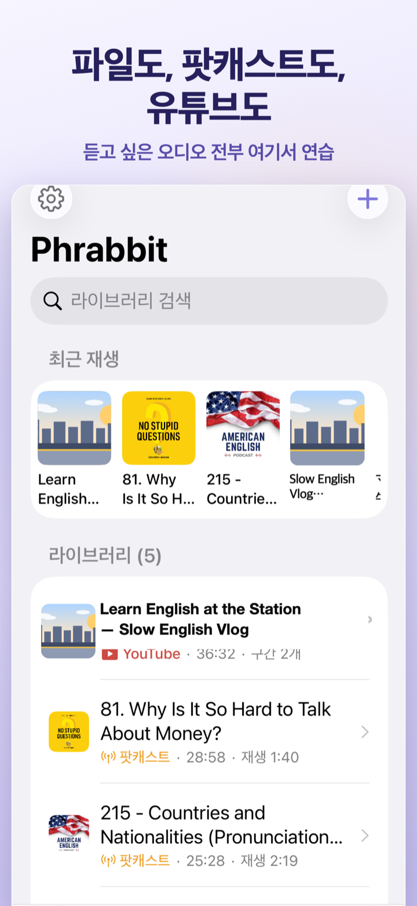
*▲ 파일, 팟캐스트, YouTube를 함께 보여주는 홈 화면*

### 2-1. 화면 구성

| 위치 | 요소 | 설명 |
|---|---|---|
| 왼쪽 위 | 톱니바퀴 | 설정 화면 열기 |
| 오른쪽 위 | 플러스 버튼 | 학습 자료 추가 메뉴 |
| 상단 | Search library | 제목으로 라이브러리 검색 |
| 중앙 위 | Recent | 최근 연습한 항목이 2개 이상 있을 때 표시 |
| 중앙 | Library | 모든 학습 자료 목록 |
| 하단 | Home / Wordbook / 학습 기록 | 홈, 단어장, 학습 기록 탭 |

처음 사용하거나 라이브러리가 비어 있을 때는 가운데의 **Add** 버튼으로 바로 자료를 추가할 수 있습니다. 자료가 하나 이상 생기면 플러스 버튼 위치를 알려주는 작은 힌트가 한 번 표시될 수 있습니다.

### 2-2. 항목 종류
목록의 아이콘과 썸네일로 자료 종류를 구분할 수 있습니다.

- **파형 아이콘** - 파일 앱에서 가져온 오디오
- **음표 아이콘** - 뮤직 라이브러리에서 가져온 곡
- **안테나 아이콘** - 팟캐스트 에피소드
- **YouTube 썸네일 또는 재생 아이콘** - YouTube 스트림

항목을 탭하면 해당 플레이어가 열립니다. 오디오는 오디오 플레이어로, YouTube는 Stream 플레이어로 열립니다.

### 2-3. 삭제
항목을 왼쪽으로 스와이프하면 **Delete**가 나타납니다. 삭제하면 해당 자료와 연결된 파형 캐시, 북마크, 자막, 저장된 쉐도잉 녹음이 함께 정리됩니다. 저장된 녹음이 있는 항목은 삭제 전에 확인창이 표시됩니다.

---

## 3. 학습 자료 추가하기

홈 화면 오른쪽 위 플러스 버튼을 누르면 추가 메뉴가 열립니다.

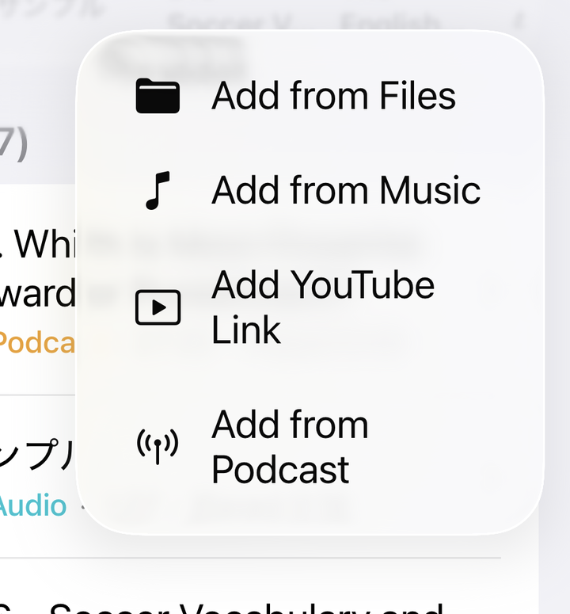
*▲ 파일, 음악, YouTube 링크, 팟캐스트를 추가하는 메뉴*

### 3-1. 파일 앱에서 추가
**Add from Files**를 누르면 시스템 파일 선택기가 열립니다. mp3, m4a, wav, aac 같은 오디오 파일을 가져올 수 있고, 여러 파일을 한 번에 선택할 수도 있습니다. 가져온 파일은 앱의 Documents 영역에 복사되어 라이브러리에 추가됩니다.

### 3-2. 뮤직 라이브러리에서 추가
**Add from Music**을 누르면 기기에 저장된 음악 목록이 열립니다.

- 이미 Phrabbit에 추가된 곡은 체크 표시로 보입니다.
- Apple Music 구독으로 내려받은 곡은 DRM 때문에 가져올 수 없습니다.
- 직접 구입했거나 CD에서 변환한 DRM 없는 곡만 사용할 수 있습니다.

곡을 탭하면 앱에서 재생 가능한 형식으로 준비한 뒤 라이브러리에 추가하고, 곧바로 플레이어를 엽니다.

### 3-3. YouTube 링크 추가
**Add YouTube Link**를 누르면 YouTube 링크 입력 화면이 열립니다.

1. YouTube 앱이나 브라우저에서 영상의 **Share**를 누릅니다.
2. **Copy Link**를 누릅니다.
3. Phrabbit으로 돌아와 **Paste**를 누릅니다.
4. 썸네일이 맞는지 확인하고 **Add**를 누릅니다.

동영상 파일은 앱 안에 저장되지 않습니다. 링크와 재생 위치, A/B 북마크, 쉐도잉 녹음 정보만 저장되고, 영상은 YouTube 임베드 플레이어로 재생됩니다.

### 3-4. 팟캐스트 추가
**Add from Podcast**는 프리미엄 기능입니다. 프리미엄 또는 무료 체험 중에는 Apple Podcasts 구독 목록이나 RSS 주소로 에피소드를 가져올 수 있습니다. 무료 체험이 끝난 상태에서는 메뉴에 잠금 표시가 보이고, 누르면 프리미엄 화면이 열립니다.

자세한 내용은 [12. 팟캐스트](#12-팟캐스트)를 참고하세요.

---

## 4. 오디오 플레이어

홈 화면에서 오디오 항목을 탭하면 전체 화면 플레이어가 열립니다.

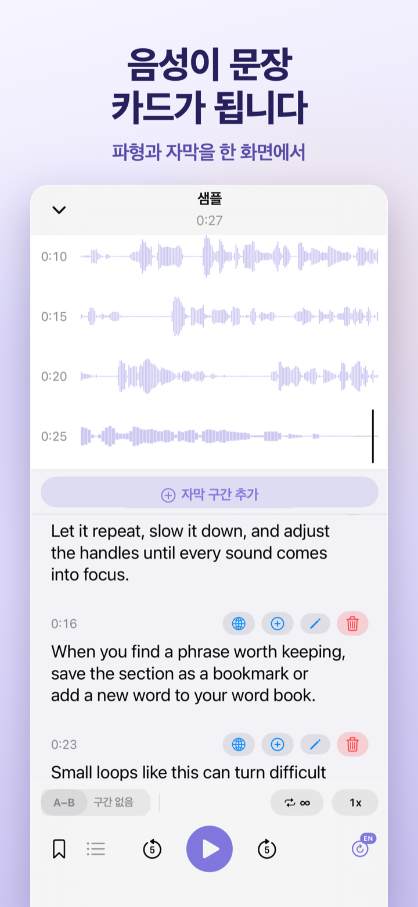
*▲ 파형과 문장 카드가 한 화면에 표시되는 오디오 플레이어*

### 4-1. 닫기와 미니 플레이어

| 방법 | 설명 |
|---|---|
| 왼쪽 위 아래 화살표 | 플레이어를 닫고 홈으로 돌아갑니다 |
| 위쪽에서 아래로 스와이프 | 플레이어를 손으로 내려 닫습니다 |

오디오가 로드된 상태에서 플레이어를 닫으면 홈 화면 아래에 미니 플레이어가 표시됩니다. 미니 플레이어를 탭하면 다시 전체 화면 플레이어로 돌아갑니다.

프리미엄 사용자가 **Settings > Playback > Background playback**을 켜둔 경우, 오디오는 화면 잠금이나 백그라운드에서도 계속 재생될 수 있습니다. 무료 사용자나 이 설정을 끈 사용자는 앱이 백그라운드로 가면 오디오가 일시정지됩니다.

### 4-2. 파형 영역
파형은 오디오를 시간축으로 보여줍니다. 검은 세로선은 현재 재생 위치이며, 재생 중에는 화면이 재생 위치를 따라 움직입니다.

- **파형 탭** - 해당 위치로 이동
- **파형 길게 누르기** - A 또는 B 포인트 설정
- **A/B 핸들 드래그** - 설정된 구간을 정밀 조정

### 4-3. 하단 컨트롤

| 컨트롤 | 기능 |
|---|---|
| **A-B** | 현재 재생 위치를 A, 다시 누르면 B로 설정 |
| 반복 횟수 | 무한 반복 또는 1, 2, 3, 5, 10회 반복 |
| 재생 속도 | 0.5x부터 2x까지 속도 변경 |
| 쉐도잉 간격 | A/B 반복 사이에 말할 시간을 넣는 모드 |
| 북마크 버튼 | 현재 A/B 구간 저장 |
| 목록 버튼 | 저장한 북마크와 내 녹음 열기 |
| 5초 뒤/앞 | 짧게 되감기 또는 앞으로 이동 |
| 재생 버튼 | 재생과 일시정지 |
| 슬립 타이머 | 5, 15, 30, 60분 뒤 자동 정지 |
| 자막 버튼 | 음성-텍스트 변환 시작 또는 관리 |

슬립 타이머가 켜지면 버튼에 남은 시간이 표시됩니다. 앱이 열려 있는 동안에는 무료 사용자도 사용할 수 있고, 잠금 화면에서도 계속 재생되는 사용 방식은 프리미엄 배경 재생 상태에 따라 달라집니다.

---

## 5. A/B 구간 반복

A/B 구간 반복은 듣고 싶은 한 문장이나 짧은 표현을 계속 반복하는 핵심 기능입니다.

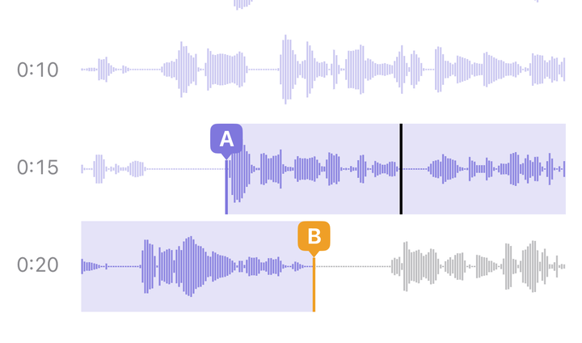
*▲ 손끝으로 A/B 구간을 맞춰 반복하는 화면*

### 5-1. A-B 버튼으로 설정
1. 반복하고 싶은 시작 지점에서 **A-B**를 누릅니다. 이 위치가 A가 됩니다.
2. 끝 지점에서 다시 **A-B**를 누릅니다. 이 위치가 B가 되고 반복이 시작됩니다.
3. 구간이 설정된 뒤 **A-B**를 누르면 A 지점으로 돌아갑니다.

상태에 따라 버튼 모양이 바뀝니다.

| 상태 | 의미 |
|---|---|
| A-B | 아직 구간이 없음 |
| A→B | A만 설정됨, B를 기다리는 중 |
| A-B 채움 | A와 B가 모두 설정되어 반복 중 |

A만 설정된 상태에서는 **Tap A-B again to set the end** 안내가 표시됩니다. 실수로 A만 찍었다면 안내 오른쪽의 닫기 버튼으로 취소할 수 있습니다.

### 5-2. 파형에서 정밀하게 설정
파형의 원하는 위치를 길게 누르면 A/B 포인트를 잡을 수 있습니다. A와 B 핸들을 손가락으로 드래그해서 위치를 더 세밀하게 맞출 수 있습니다.

### 5-3. A/B 정보 바
A와 B가 모두 설정되면 파형 아래에 보라색 정보 바가 표시됩니다.

정보 바에서는 다음을 할 수 있습니다.

- 구간 시간 확인
- 정보 바를 눌러 A와 B를 조금씩 미세 조정
- 마이크 버튼으로 쉐도잉 녹음 열기
- 닫기 버튼으로 A/B 구간 해제

### 5-4. 쉐도잉 간격
A/B 구간이 설정되면 **person.wave.2** 모양의 버튼이 나타납니다. 이 버튼을 켜면 반복 사이에 짧은 무음 시간이 생겨, 방금 들은 문장을 직접 말해볼 수 있습니다. 녹음하지 않아도 쓸 수 있는 무료 연습 기능입니다.

무음 시간이 진행되는 동안에는 **Speak** 카운트다운이 표시됩니다.

---

## 6. 북마크와 반복 목록

북마크는 자주 연습하고 싶은 A/B 구간을 저장하는 기능입니다.

### 6-1. 북마크 저장
1. A/B 구간을 먼저 설정합니다.
2. 하단의 북마크 버튼을 누릅니다.
3. 이름을 입력하고 **Save**를 누릅니다.

이름을 비워두면 파일 이름과 구간 길이를 기준으로 자동 이름이 만들어집니다. 같은 구간을 다시 저장하려고 하면 중복 저장되지 않습니다.

### 6-2. 북마크 목록
목록 버튼을 누르면 현재 파일의 북마크가 열립니다. 북마크를 탭하면 해당 구간이 A/B로 복원되고 바로 연습할 수 있습니다.

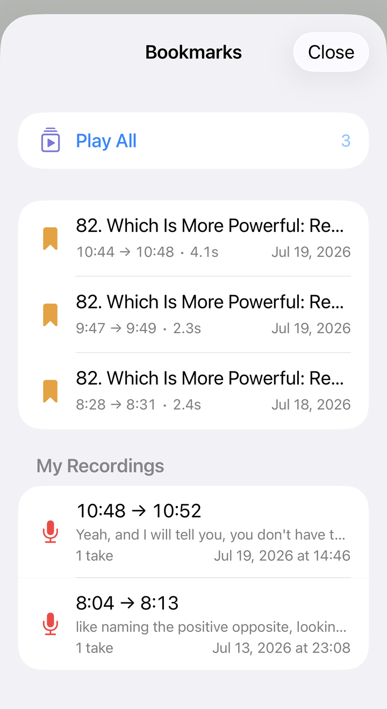
*▲ 저장한 A/B 구간과 My Recordings를 함께 여는 목록*

북마크가 2개 이상 있으면 **Play All** 메뉴가 나타날 수 있습니다. 이 기능은 여러 북마크를 순서대로 재생하고, 각 북마크를 1, 2, 3회씩 반복하도록 설정할 수 있습니다.

무료 사용자는 오디오 파일당 북마크 1개까지 새로 만들 수 있습니다. 프리미엄 또는 무료 체험 중에는 제한 없이 만들 수 있습니다. 프리미엄 또는 무료 체험 기간에 저장해 둔 북마크는 무료 상태가 된 뒤에도 목록에서 열어 다시 연습할 수 있지만, 무료 한도를 넘는 새 북마크는 추가할 수 없습니다. YouTube 스트림의 북마크 저장은 프리미엄 기능입니다.

---

## 7. 음성-텍스트(STT) 자막

STT는 오디오를 문장 단위 자막으로 변환해 주는 기능입니다. 프리미엄 또는 무료 체험 중에 사용할 수 있습니다.

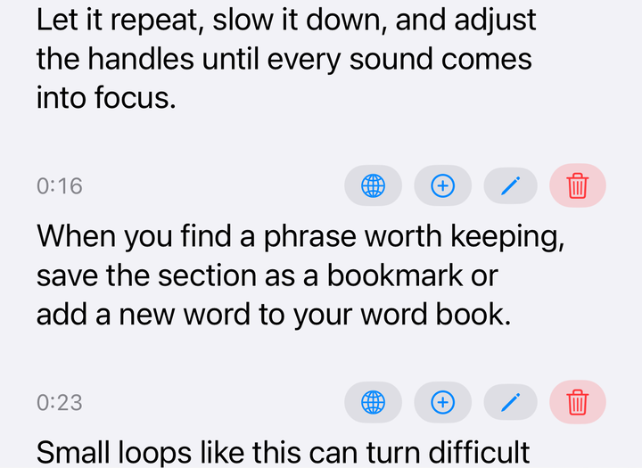
*▲ 음성을 문장 단위 자막 카드로 변환한 화면*

### 7-1. 변환 시작
1. 오디오 플레이어 하단 오른쪽의 자막 버튼을 누릅니다.
2. 처음 변환하는 파일이면 언어 선택 화면이 열립니다.
3. 오디오의 실제 언어를 고르고 **Done**을 누릅니다.

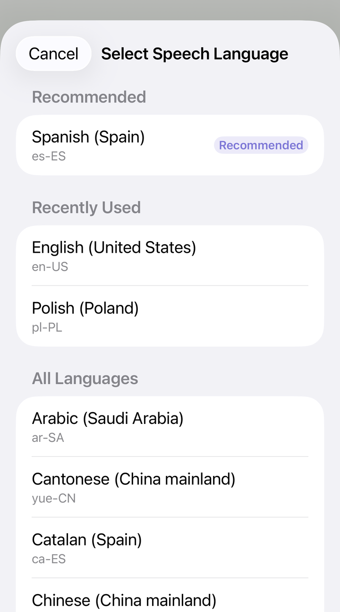
*▲ 파일 정보와 제목을 바탕으로 추천 언어와 최근 사용 언어를 보여주는 화면*

언어 추천은 이 파일에서 이전에 선택한 언어, 팟캐스트 RSS 언어 정보, 제목에서 감지한 언어와 문자, 기기 언어 등을 순서대로 참고합니다. 최근 사용한 언어는 **Recently Used**에 따로 표시됩니다. 추천이 틀릴 수 있으니 실제 오디오 언어와 맞는지 확인해 주세요.

이미 자막이 있는 파일에서 자막 버튼을 누르면 다음 옵션이 표시됩니다.

- **Re-run with current language** - 현재 언어로 다시 변환
- **Change Language and Re-run** - 언어를 바꿔 다시 변환
- **Clear Script** - 자동 생성 자막 삭제

자막이 없는 상태에서 자막 버튼을 길게 누르면 변환 전 언어를 먼저 바꿀 수 있습니다.

### 7-2. 변환 중

변환 중에는 **Converting...** 또는 **Downloading language model...** 진행 막대가 표시됩니다. 일부 언어는 처음 사용할 때 기기 내 음성 모델을 한 번 다운로드할 수 있습니다.

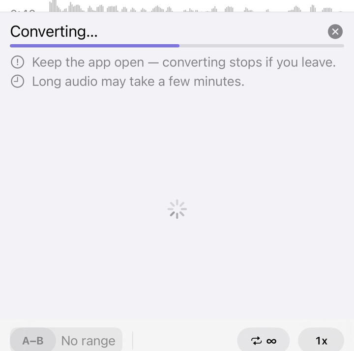
*▲ 변환 중에는 진행 막대와 앱을 열어두라는 안내가 표시됩니다*

중요한 점:

- 변환 중에는 앱을 열어 두세요. 앱을 나가거나 잠그면 변환이 중단될 수 있습니다.
- 긴 오디오는 몇 분 걸릴 수 있습니다.
- 취소하면 이번 변환은 중단되고 기존 자막은 유지됩니다.
- 모델 다운로드나 일부 복구 처리는 Wi-Fi 설정의 영향을 받습니다.

### 7-3. 변환 결과 보기
변환이 끝나면 자막 카드가 시간순으로 표시됩니다.

각 카드에는 다음 정보가 표시될 수 있습니다.

- 시작 시간
- 자막 출처 표시
- 낮은 신뢰도 경고
- **Approx. position** 배지: 텍스트는 인식됐지만 위치가 대략적인 경우
- 자막 본문
- 번역, 단어장 추가, 편집, 삭제 버튼

자막 카드를 탭하면 그 카드의 구간이 A/B로 설정되고 바로 반복 재생됩니다. 현재 재생 중인 카드는 강조 표시되고, A/B 구간 안에 있는 카드는 배경색이 달라집니다.

### 7-4. 인식하지 못한 구간
음성이 없거나 인식하기 어려운 구간은 **Could not recognize** 카드로 표시될 수 있습니다. 이때 **Enter Manually**로 직접 자막을 입력할 수 있습니다.

### 7-5. 자막 정보 보기
자막 영역의 정보 버튼이 보이는 경우, 변환 일시, 사용한 인식 엔진, 품질 안내를 확인할 수 있습니다. 자동 자막은 어떤 모델을 사용해도 틀릴 수 있으므로 중요한 표현은 직접 확인하고 수정하는 것을 권장합니다.

---

## 8. 자막 편집, 번역, 직접 추가

### 8-1. 자막 직접 추가
자막 영역 위쪽의 **Add Segment**를 누르면 현재 재생 위치를 기준으로 새 자막 구간을 만들 수 있습니다. 텍스트를 입력하고 **Add**를 누르면 카드가 추가됩니다.

시트 안의 재생 버튼으로 해당 구간을 미리 들어볼 수 있습니다.

### 8-2. 자막 편집
자막 카드의 편집 버튼을 누르면 텍스트를 수정할 수 있습니다. STT로 만든 자막을 고친 경우 원래 텍스트가 함께 보이고, 필요하면 **Reset**으로 되돌릴 수 있습니다.

### 8-3. 번역
자막 카드의 번역 버튼을 누르면 iOS의 시스템 번역 화면이 열립니다. 번역은 학습 보조용이며, 문맥에 따라 부정확할 수 있습니다.

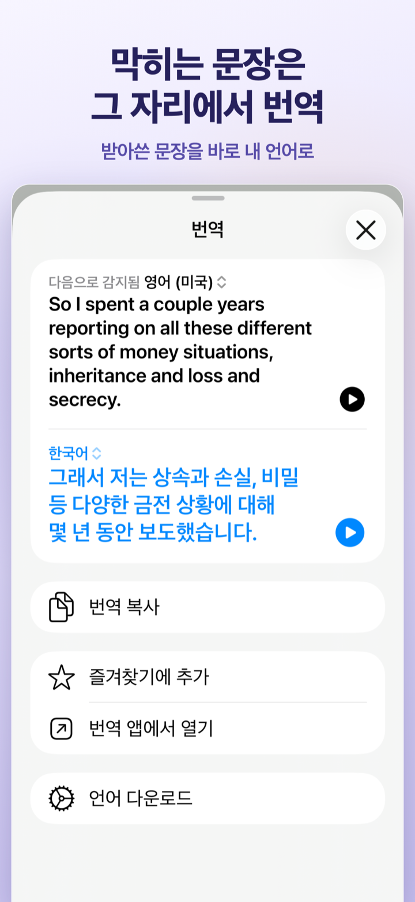
*▲ 자막 문장을 바로 번역해 확인하는 화면*

### 8-4. 단어장 추가
자막 카드의 플러스 버튼을 누르면 그 문장에서 단어나 표현을 골라 단어장에 저장할 수 있습니다. 단어장 자체는 프리미엄 기능이므로, 무료 체험이 끝난 상태에서는 프리미엄 화면이 열립니다.

---

## 9. 단어장

단어장은 자막 카드에서 저장한 단어와 표현을 모아 복습하는 공간입니다. 프리미엄 또는 무료 체험 중에 사용할 수 있습니다.

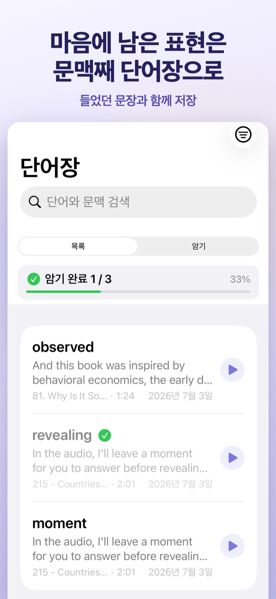
*▲ 문맥과 함께 표현을 저장하는 단어장*

### 9-1. 단어 저장
자막 카드에서 플러스 버튼을 누르면 **Add to Wordbook** 화면이 열립니다.

저장할 수 있는 내용:

- 단어 또는 표현
- 뜻
- 학습 문맥
- 문맥 번역
- 메모
- Apple Intelligence 설명

문장에서 자동으로 추출된 단어 칩을 고르거나, **Custom Input**에 직접 입력할 수 있습니다. 한국어처럼 띄어쓰기가 있는 언어는 단어 단위로, 일본어와 중국어는 앱이 다시 토큰화해 더 자연스러운 단위로 보여주려고 합니다.

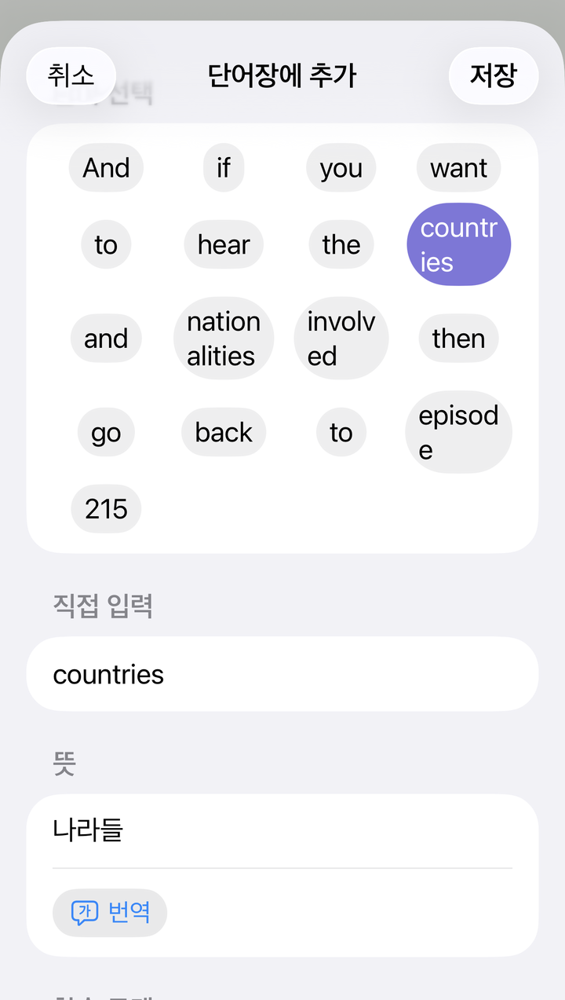
*▲ 자막 문장에서 단어를 고르고 뜻과 학습 문맥을 저장하는 화면*

### 9-2. Translate 채우기
**Meaning**과 **Context Translation**에는 **Translate** 버튼이 있습니다. 버튼을 누르면 iOS 번역 기능으로 뜻이나 문맥 번역을 채울 수 있습니다. 결과는 저장 전에 직접 수정할 수 있습니다.

iOS 번역 기능은 오디오 언어와 기기 언어가 같을 때 별도의 번역을 만들지 않을 수 있습니다. 이 경우에는 뜻이나 문맥 번역을 직접 입력하거나 수정해 주세요.

### 9-3. Apple Intelligence 설명
Apple Intelligence를 사용할 수 있는 경우 **AI Explanation** 섹션이 표시될 수 있습니다. **Generate Explanation**을 누르면 선택한 단어가 이 문맥에서 어떻게 쓰였는지 설명을 생성합니다.

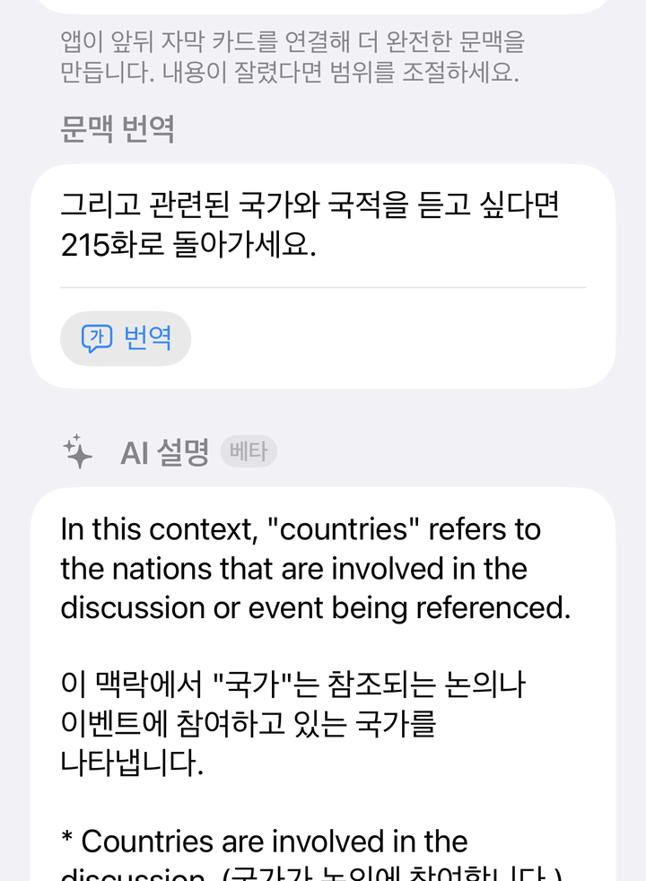
*▲ 선택한 단어의 문맥상 의미와 예문을 생성한 AI Explanation*

이 섹션은 다음 조건을 모두 만족할 때만 보입니다.

- iOS 26 이상
- Apple Intelligence를 지원하는 기기
- 기기 설정에서 Apple Intelligence가 켜져 있고 모델이 준비된 상태
- 자막 언어, 팟캐스트 언어 정보, 또는 문장 텍스트로 학습 언어를 판별할 수 있는 상태
- 학습 언어와 기기 언어가 Apple Intelligence 모델에서 지원되는 언어인 상태

같은 언어라는 이유만으로 AI 설명이 항상 숨겨지는 것은 아닙니다. 다만 위 조건 중 하나라도 맞지 않으면 섹션이 보이지 않고, **Translate** 버튼은 iOS 번역 기능의 제한을 그대로 따릅니다. 생성 결과는 기기에서 만들어지는 베타 기능이며 내용이 틀릴 수 있습니다. 저장 전에 직접 고치거나 지울 수 있습니다.

### 9-4. 목록과 플래시카드
단어장 탭에서는 두 가지 모드를 사용할 수 있습니다.

| 모드 | 설명 |
|---|---|
| **List** | 단어, 뜻, 문맥, 출처 파일, 추가 날짜를 한눈에 확인 |
| **Flashcards** | 카드를 넘기며 암기 연습 |

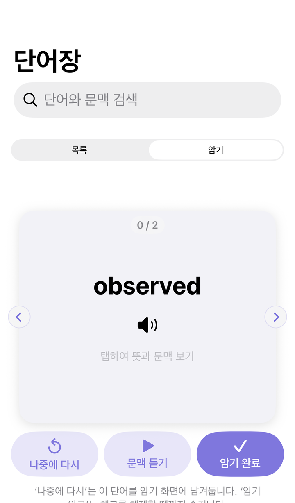
*▲ 자투리 시간에 카드로 복습하는 화면*

단어 상세 화면에서는 발음 듣기, 뜻/메모 수정, 원본 오디오 열기, 사전 검색, Apple Intelligence 설명 재생성을 할 수 있습니다. 외운 단어는 **Memorized**로 표시할 수 있고, 목록에서 외운 단어 숨기기 필터를 켤 수 있습니다.

---

## 10. YouTube 스트림 연습

YouTube 링크를 추가하면 Stream 플레이어가 열립니다. YouTube 영상은 앱에 저장되지 않고, YouTube 임베드 플레이어로 재생됩니다.

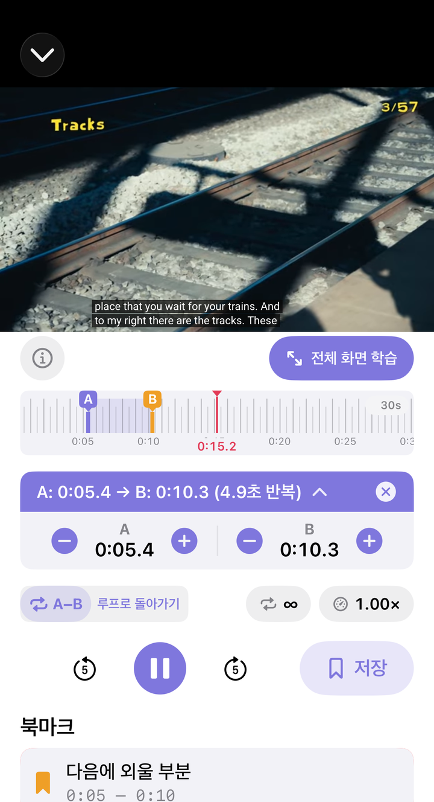
*▲ YouTube 링크를 듣기 교재처럼 반복 연습하는 화면*

### 10-1. 기본 구조
Stream 플레이어는 위쪽에 YouTube 플레이어, 아래쪽에 Phrabbit의 A/B 반복 컨트롤을 표시합니다.

주요 특징:

- YouTube의 원래 재생 화면과 CC 버튼 사용
- Phrabbit의 A/B 반복, 반복 횟수, 배속 컨트롤 사용
- 긴 영상을 정밀하게 이동하기 위한 시간 눈금자 사용
- 전체화면 연습 지원
- YouTube 링크별 북마크와 쉐도잉 녹음 저장

### 10-2. YouTube 자막과 단어장 제한
YouTube 자막은 YouTube 플레이어 안에서만 표시됩니다. Phrabbit은 YouTube 자막 텍스트를 앱 안으로 가져오지 않습니다.

따라서 YouTube 스트림에서는 다음이 제한됩니다.

- STT 자막 생성
- YouTube 자막을 단어장에 바로 추가
- YouTube 원본 파형 표시

대신 YouTube 플레이어의 **CC** 버튼으로 자막을 켜고, Phrabbit의 A/B 반복과 쉐도잉 기능으로 구간 연습을 할 수 있습니다.

### 10-3. Full-screen Practice
**Full-screen Practice**를 누르면 영상이 더 크게 표시되고, A/B 컨트롤은 전체화면 안에서 계속 사용할 수 있습니다. iPhone에서는 앱이 세로 화면을 유지하면서 플레이어 영역을 크게 보여주고, iPad에서는 화면 크기에 맞춰 더 넓게 표시됩니다.

YouTube 자체 전체화면 버튼이 아니라 Phrabbit의 **Full-screen Practice**를 사용하는 이유는, YouTube 자막과 Phrabbit의 A/B 컨트롤을 함께 유지하기 위해서입니다.

### 10-4. 시간 눈금자
Stream에는 오디오 파형 대신 시간 눈금자가 있습니다.

- **드래그** - 영상 위치 이동
- **길게 누르기** - A/B 포인트 설정
- **핀치** - 눈금 확대/축소
- **A/B 핸들 조정** - 구간 미세 조정

YouTube의 임베드 플레이어는 실제 오디오 샘플을 앱에 제공하지 않기 때문에, 가짜 파형 대신 시간 눈금자를 사용합니다.

### 10-5. YouTube 백그라운드 동작
YouTube 스트림은 잠금 화면이나 백그라운드에서 계속 재생되지 않습니다. 앱이 백그라운드로 가면 영상을 정지하고 위치를 기억한 뒤, 앱으로 돌아오면 그 위치를 복원합니다. 이는 YouTube 임베드 플레이어와 iOS WebKit의 제한 때문입니다.

---

## 11. 쉐도잉 녹음과 비교

쉐도잉은 A/B 구간을 듣고, 직접 말해 보고, 내 녹음을 원본과 비교하는 기능입니다.

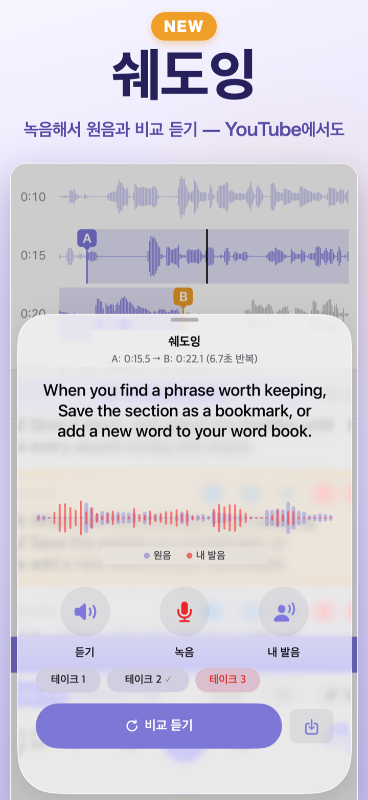
*▲ A/B 구간을 듣고 녹음해 원본과 비교하는 쉐도잉 화면*

### 11-1. 쉐도잉 간격
녹음 없이도 사용할 수 있는 연습 방법입니다.

1. A/B 구간을 설정합니다.
2. 쉐도잉 간격 버튼을 켭니다.
3. 구간이 재생된 뒤 무음 시간이 생기면 직접 따라 말합니다.
4. 카운트다운이 끝나면 다시 원본이 재생됩니다.

이 기능은 오디오와 YouTube 스트림 모두에서 사용할 수 있습니다.

### 11-2. 녹음과 비교
녹음/비교는 프리미엄 기능입니다.

1. A/B 구간을 설정합니다.
2. A/B 정보 바의 마이크 버튼 또는 Stream 컨트롤의 마이크 버튼을 누릅니다.
3. **Listen**으로 원본 구간을 듣습니다.
4. **Record**를 눌러 내 목소리를 녹음합니다.
5. **My take**로 내 녹음만 들어봅니다.
6. **Compare**로 원본과 내 녹음을 이어서 비교합니다.

처음 사용할 때는 마이크 권한을 요청합니다. 녹음은 기기 안에 저장됩니다.

오디오 파일에서는 원본 파형과 내 녹음 파형을 함께 볼 수 있습니다. YouTube 스트림에서는 원본 파형을 가져올 수 없으므로 내 녹음 파형만 표시됩니다.

### 11-3. 자막과 함께 연습
오디오 파일에 자막이 있고, A/B 구간과 겹치는 자막 카드가 있으면 쉐도잉 화면에 연습 문장이 크게 표시됩니다. 원본을 듣는 동안 현재 문장이 하이라이트되어 따라 읽기 쉽습니다.

YouTube 스트림의 자막은 YouTube 플레이어 안에만 있으므로 쉐도잉 화면으로 가져오지는 않습니다. 대신 전체화면 연습에서 YouTube CC 자막을 함께 보면서 연습할 수 있습니다.

### 11-4. 내 녹음 저장과 다시 열기
마음에 드는 테이크는 저장 버튼으로 보관할 수 있습니다. 저장된 녹음은 북마크 목록이나 Stream의 **My Recordings** 섹션에 표시됩니다.

저장된 녹음을 탭하면 그 녹음이 만들어진 A/B 구간으로 돌아가고, 쉐도잉 화면이 다시 열립니다. 같은 구간의 여러 테이크는 한 연습 지점으로 묶여 표시됩니다.

---

## 12. 팟캐스트

팟캐스트 다운로드는 프리미엄 기능입니다. Apple Podcasts 구독 목록 또는 RSS 주소로 에피소드를 가져와 오디오 플레이어에서 연습할 수 있습니다.

### 12-1. Apple Podcasts에서 가져오기
홈 화면 플러스 메뉴에서 **Add from Podcast**를 누릅니다. 처음 사용할 때는 미디어 라이브러리 권한을 요청할 수 있습니다. 허용하면 Apple Podcasts에서 구독 중인 채널이 표시됩니다.

채널을 탭하면 에피소드 목록이 열립니다.

### 12-2. 에피소드 배지

| 배지 | 의미 |
|---|---|
| **Script** | 시간 정보가 있는 공식 자막 제공 |
| **Text only** | 텍스트만 있는 공식 자료 제공 |
| 배지 없음 | 공식 자막 없음 |

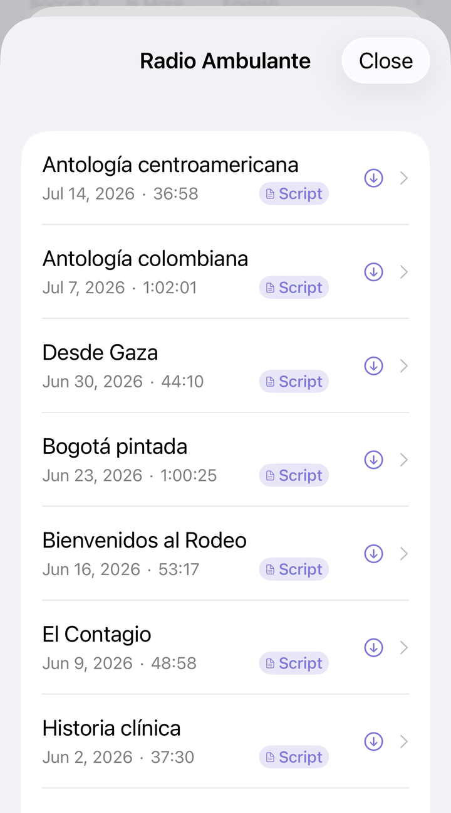
*▲ Script 배지가 있는 에피소드는 공식 자막을 함께 가져올 수 있습니다*

**Script** 배지가 있는 에피소드는 앱이 STT를 새로 돌리지 않고 팟캐스트가 제공하는 공식 자막을 가져올 수 있습니다. 보통 자동 인식보다 정확하고 기다릴 필요도 적으므로, 학습 자료를 고를 때 먼저 추천합니다.

### 12-3. RSS 주소 직접 입력
**Add via RSS URL (advanced)**를 펼치면 RSS 주소를 직접 입력할 수 있습니다. Apple Podcasts 검색으로 나오지 않는 팟캐스트나 직접 알고 있는 RSS 주소가 있을 때 사용합니다.

### 12-4. 다운로드와 셀룰러
기본 설정은 **Download over Wi-Fi only**입니다. 셀룰러 다운로드를 허용하면 큰 에피소드를 받을 때 확인창이 표시될 수 있습니다.

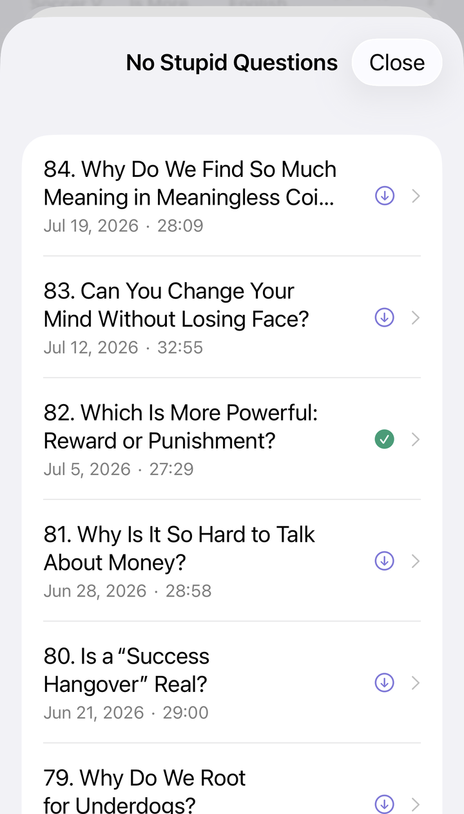
*▲ 다운로드 전, 다운로드 완료 상태를 에피소드 목록에서 확인할 수 있습니다*

일부 팟캐스트 파일은 처음 재생할 때 앱이 재생 가능한 형식으로 준비하는 시간이 걸릴 수 있습니다.

---

## 13. 학습 기록과 설정

### 13-1. 학습 기록 탭
**학습 기록(Progress)** 탭에서는 최근 학습량을 확인할 수 있습니다.

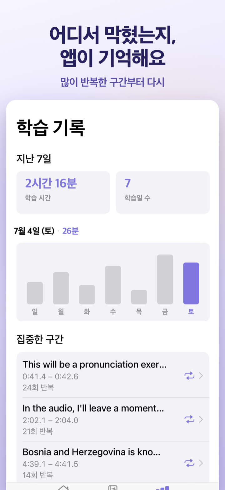
*▲ 많이 반복한 구간과 최근 7일 학습량을 확인하는 화면*

주요 항목:

- **Last 7 Days** - 최근 7일 연습 시간과 활동일
- 막대 그래프 - 날짜별 연습 시간
- **Focused Segments** - 최근 반복해서 연습한 구간
- **Most Practiced** - 많이 연습한 오디오나 YouTube 항목
- **All Time** - 전체 누적 연습 시간

Focused Segments나 Most Practiced 항목을 탭하면 원본 자료로 돌아가 다시 연습할 수 있습니다. 통계는 이 기능이 추가된 이후의 연습부터 기록됩니다.

### 13-2. 설정 화면
홈 화면 왼쪽 위 톱니바퀴를 누르면 설정이 열립니다.

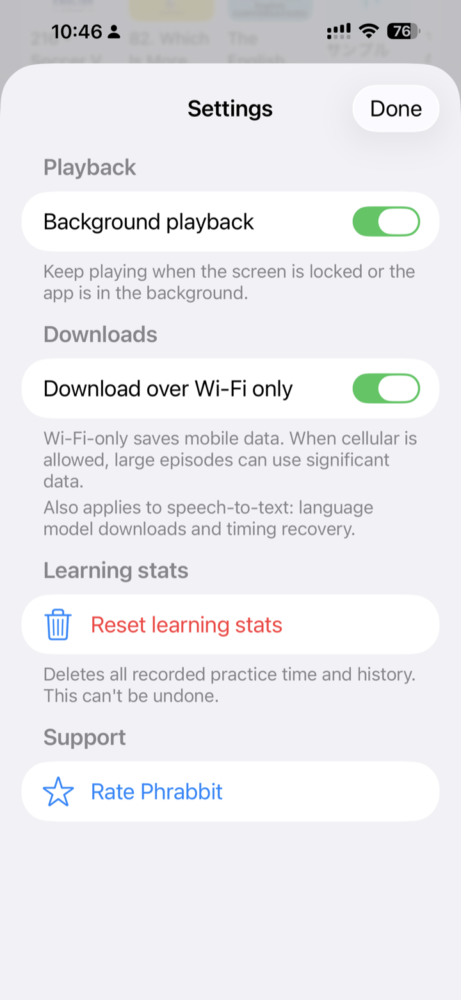
*▲ 배경 재생, 다운로드, 학습 기록 삭제, Support 항목을 모은 설정 화면*

설정에서 할 수 있는 일:

- **Background playback** - 프리미엄 사용자의 잠금 화면/백그라운드 오디오 재생 설정
- **Download over Wi-Fi only** - 팟캐스트 다운로드, STT 모델 다운로드, 시간 정보 복구에 Wi-Fi 우선 적용
- **Ask before cellular download** - 셀룰러 다운로드 전 확인
- **Reset learning stats** - 학습 기록 삭제
- **Rate Phrabbit** - App Store 리뷰 작성 화면 열기

학습 기록 삭제는 되돌릴 수 없으니 주의하세요.

---

## 14. 무료 vs 프리미엄

### 무료로 사용할 수 있는 기능

- 로컬 오디오 파일 가져오기
- 뮤직 라이브러리의 DRM 없는 곡 가져오기
- YouTube 링크 추가와 A/B 반복 연습
- 파형 보기, 시간 눈금자, A/B 구간 반복
- 반복 횟수와 재생 속도 조절
- 쉐도잉 간격
- 슬립 타이머
- 오디오 북마크 파일당 1개 새로 만들기
- 프리미엄 또는 무료 체험 기간에 저장한 기존 오디오 북마크 열기
- 학습 기록

### 프리미엄 또는 무료 체험 중 사용 가능한 기능

- 음성-텍스트(STT) 자막 변환
- 자막과 파형의 실시간 연동
- 단어장
- Apple Intelligence 설명 생성(지원 기기에서)
- 오디오 북마크 무제한
- YouTube 스트림 북마크
- 팟캐스트 다운로드
- 쉐도잉 녹음, 비교, 저장
- 오디오 백그라운드 재생과 잠금 화면 제어

### 결제 방식
Phrabbit Premium은 **일회성 구매**입니다. 구독제가 아니며, 한 번 구매하면 같은 Apple ID에서 계속 사용할 수 있습니다. 기기를 바꿨다면 프리미엄 화면의 **Restore Purchase**로 구매를 복원하세요.

---

## 15. 자주 묻는 질문

**Q. Apple Music 구독으로 들은 곡을 가져올 수 없나요?**

A. Apple Music 구독으로 내려받은 곡은 DRM 보호가 걸려 있어 다른 앱에서 사용할 수 없습니다. iTunes Store에서 직접 구매했거나 CD에서 변환한 DRM 없는 곡만 가져올 수 있습니다.

**Q. 음성 인식 결과가 부정확합니다.**

A. 오디오의 실제 언어와 선택한 STT 언어가 같은지 먼저 확인하세요. 배경 음악, 잡음, 여러 사람이 동시에 말하는 구간은 인식이 어려울 수 있습니다. 필요한 부분은 자막 편집이나 Add Segment로 직접 고치는 것이 가장 정확합니다.

**Q. STT 변환 중 앱을 나가도 계속되나요?**

A. 아니요. 현재 STT 변환은 앱을 열어 둔 상태에서 진행해야 합니다. 화면을 잠그거나 다른 앱으로 이동하면 변환이 중단될 수 있습니다. 오디오 백그라운드 재생과 STT 변환은 서로 다른 기능입니다.

**Q. 오디오는 잠금 화면에서도 계속 재생되나요?**

A. 프리미엄 또는 무료 체험 중이고 **Background playback** 설정이 켜져 있으면 오디오는 잠금 화면과 백그라운드에서도 계속 재생될 수 있습니다. 이때 잠금 화면, 제어 센터, 이어폰 버튼으로 재생/일시정지와 5초 이동을 사용할 수 있습니다. 무료 체험이 끝났거나 설정을 끄면 백그라운드 진입 시 일시정지됩니다.

**Q. YouTube도 백그라운드에서 계속 재생되나요?**

A. 아니요. YouTube 스트림은 백그라운드 재생을 지원하지 않습니다. 앱은 백그라운드로 갈 때 영상을 멈추고 위치를 기억한 뒤, 다시 돌아오면 그 위치를 복원합니다.

**Q. YouTube 영상이 앱 안에서 재생되지 않습니다.**

A. 일부 영상은 소유자가 YouTube 외부 재생을 허용하지 않아 임베드 플레이어에서 재생되지 않을 수 있습니다. 이 경우 Phrabbit 안에서 사용할 수 없습니다.

**Q. 데이터가 인터넷으로 전송되나요?**

A. 단어장, 북마크, 자막, 녹음은 기기에 저장됩니다. STT는 가능한 경우 기기 내 모델을 사용합니다. 다만 언어, iOS 버전, 모델 설치 상태에 따라 Apple의 음성 인식 서비스나 모델 다운로드가 필요할 수 있습니다. **Download over Wi-Fi only** 설정은 모델 다운로드와 일부 네트워크 기반 복구에도 적용됩니다. YouTube 영상은 YouTube 임베드 플레이어로 재생됩니다.

**Q. Apple Intelligence 설명은 항상 정확한가요?**

A. 아니요. 베타 기능이며 틀릴 수 있습니다. 단어장에 저장하기 전에 뜻, 예문, 설명을 직접 확인하고 필요한 부분을 수정하세요.

**Q. AI Explanation이 보이지 않아요.**

A. 이 기능은 iOS 26 이상, Apple Intelligence 지원 기기, Apple Intelligence 활성화와 모델 준비, 지원되는 학습 언어와 기기 언어가 모두 필요합니다. 학습 언어를 판별할 수 없거나 해당 언어가 모델에서 지원되지 않으면 섹션이 보이지 않을 수 있습니다. 같은 언어에서는 iOS 번역 기능이 별도 번역을 만들지 못할 수도 있으므로, 필요한 경우 직접 입력해 주세요.

**Q. 저장한 녹음은 어디에 있나요?**

A. 오디오 파일의 저장 녹음은 북마크 목록의 **My Recordings**에, YouTube 스트림의 저장 녹음은 Stream 화면의 **My Recordings**에 표시됩니다. 원본 오디오나 YouTube 항목을 삭제하면 연결된 녹음도 함께 삭제됩니다.

**Q. 기기를 바꾸면 내 자료도 옮겨지나요?**

A. 현재 앱의 학습 데이터는 기본적으로 기기 안에 저장됩니다. 같은 Apple ID로 **Restore Purchase**를 하면 프리미엄 구매는 복원되지만, 단어장, 북마크, 자막, 녹음 같은 학습 데이터가 자동으로 다른 기기로 옮겨지는 것은 아닙니다.

---

지원이 필요하면 앱 스토어 페이지의 개발자 연락처를 이용하거나, 앱의 **Settings > Support**에서 App Store 리뷰/문의 경로를 확인해 주세요.
