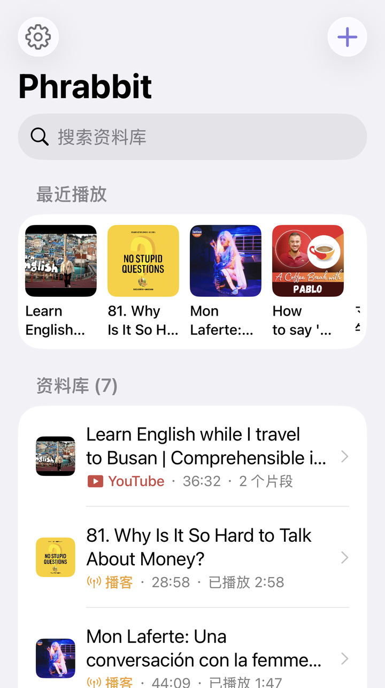
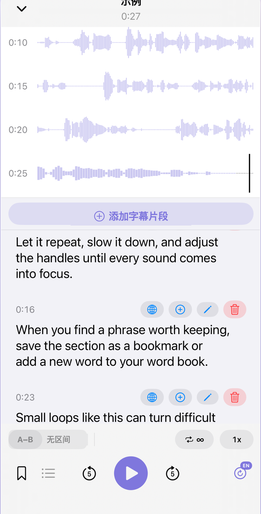
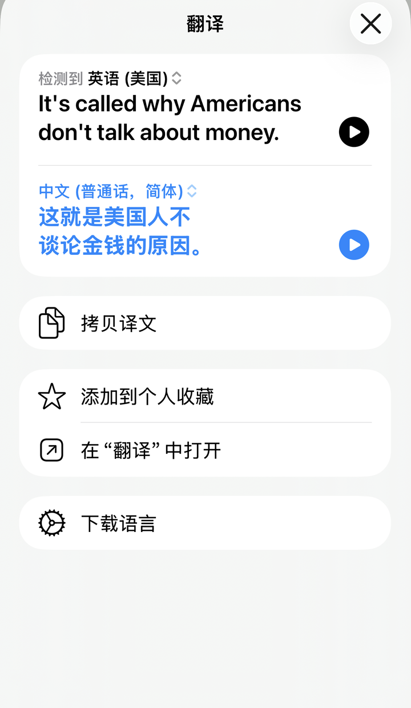
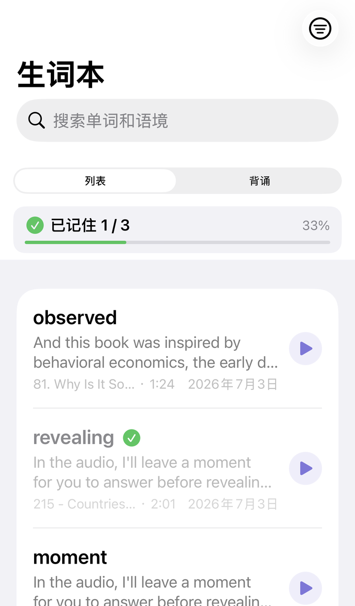
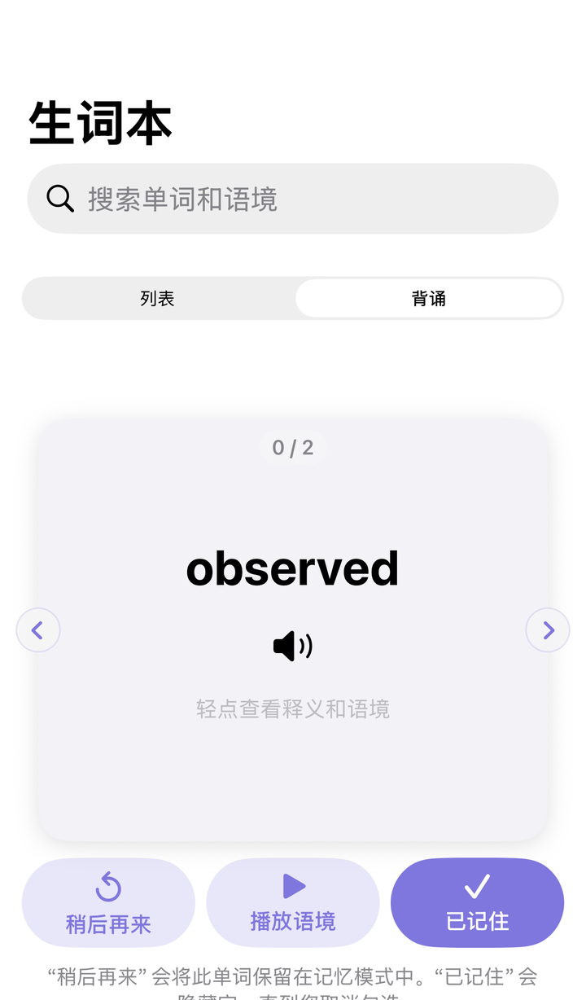
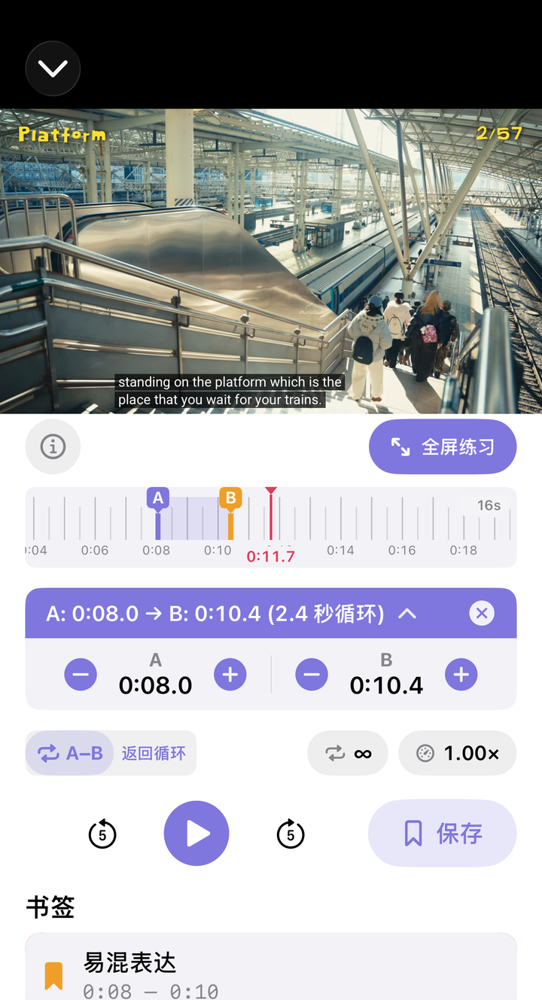
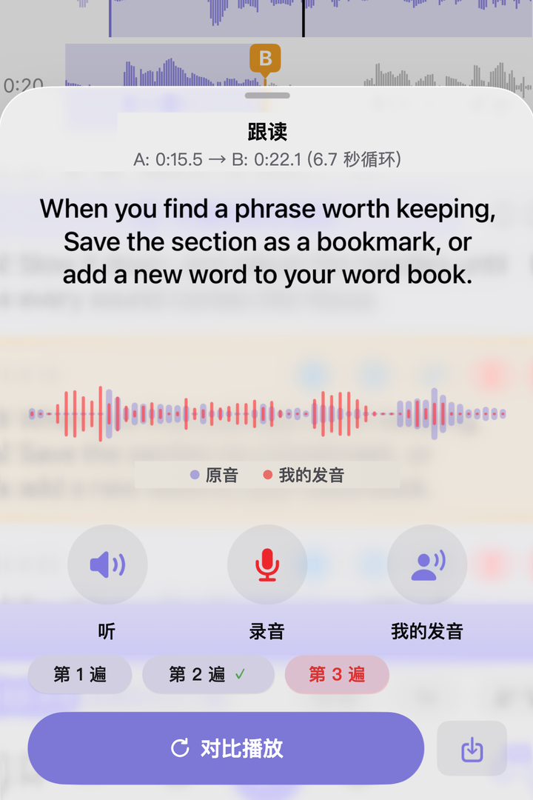
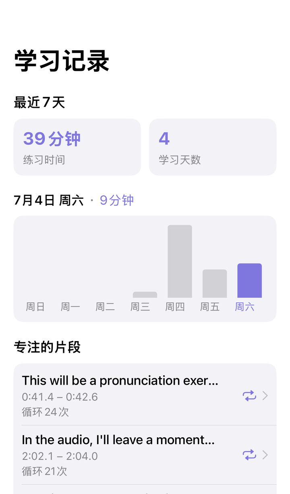

# Phrabbit 用户指南

Phrabbit 是一款用于外语听力练习的 A/B 区间循环应用。你可以把音频文件、音乐库曲目、播客和 YouTube 链接作为学习材料添加进来，然后反复听指定片段，或跟读并录下自己的声音。应用还支持语音转文字字幕、单词本、跟读录音和学习记录。

> 注：本指南中的按钮名称以应用里的英文 UI 为准。根据设备语言设置，部分文字可能会显示为本地化语言。

## 目录

1. [开始使用](#1-开始使用)
2. [主屏幕与资料库](#2-主屏幕与资料库)
3. [添加学习材料](#3-添加学习材料)
4. [音频播放器](#4-音频播放器)
5. [A/B 区间循环](#5-ab-区间循环)
6. [书签与循环列表](#6-书签与循环列表)
7. [语音转文字（STT）字幕](#7-语音转文字stt字幕)
8. [编辑、翻译与手动添加字幕](#8-编辑翻译与手动添加字幕)
9. [单词本](#9-单词本)
10. [YouTube 流媒体练习](#10-youtube-流媒体练习)
11. [跟读录音与比较](#11-跟读录音与比较)
12. [播客](#12-播客)
13. [学习记录与设置](#13-学习记录与设置)
14. [免费版 vs 高级版](#14-免费版-vs-高级版)
15. [常见问题](#15-常见问题)

## 1. 开始使用

### 1-1. 首次启动 - 引导页
首次打开应用时，会看到介绍 Phrabbit 基本流程的引导画面。

1. **波形与 A/B 区间循环** - 一边看见声音的形状，一边设置起点 A 和终点 B，只重复那一段。
2. **字幕、单词本和复习流程** - 看字幕、保存不熟悉的单词，并积累学习记录。

最后一页可以选择以下两种操作之一。

| 按钮 | 说明 |
|---|---|
| **Try with a sample** | 打开示例音频，跟着播放器教程试用 |
| **Skip** | 直接进入主屏幕 |

### 1-2. 免费试用
完成引导后会开始 **3 天免费试用**。试用期间可以自由体验高级版功能。试用中，播放器上方会显示 **Trial** 横幅，点按横幅即可打开高级版购买页面。

## 2. 主屏幕与资料库

主屏幕是所有学习材料汇集的地方。本地音频、音乐库曲目、播客单集和 YouTube 链接会一起显示在同一个资料库列表中。

*▲ 同时显示文件、播客和 YouTube 项目的主屏幕*

### 2-1. 界面布局

| 位置 | 元素 | 说明 |
|---|---|---|
| 左上 | 齿轮 | 打开设置 |
| 右上 | 加号按钮 | 打开学习材料添加菜单 |
| 顶部 | Search library | 按标题搜索资料库 |
| 中上 | Recent | 最近练习过的项目达到 2 个以上时显示 |
| 中部 | Library | 显示所有学习材料 |
| 底部 | Home / Wordbook / Progress | 切换主屏幕、单词本和学习记录 |

首次使用或资料库为空时，可以用中间的 **Add** 按钮直接添加材料。添加至少一个项目后，应用可能会显示一次小提示，告诉你加号按钮的位置。

### 2-2. 项目类型
列表中的图标和缩略图可以帮助你区分材料类型。

- **波形图标** - 从“文件”应用导入的音频
- **音符图标** - 从音乐库导入的曲目
- **天线图标** - 播客单集
- **YouTube 缩略图或播放图标** - YouTube 流媒体

点按项目会打开对应播放器。音频会打开音频播放器，YouTube 链接会打开 Stream 播放器。

### 2-3. 删除
将项目向左滑动会出现 **Delete**。删除后，与该材料关联的波形缓存、书签、字幕和已保存的跟读录音也会一起清理。如果该项目有已保存录音，删除前会显示确认窗口。

## 3. 添加学习材料

点按主屏幕右上角的加号按钮，会打开添加菜单。

*▲ 添加文件、音乐、YouTube 链接和播客的菜单*

### 3-1. 从“文件”应用添加
点按 **Add from Files** 会打开系统文件选择器。你可以导入 mp3、m4a、wav、aac 等音频文件，也可以一次选择多个文件。导入的文件会复制到应用的 Documents 区域，并添加到资料库。

### 3-2. 从音乐库添加
点按 **Add from Music** 会打开设备中保存的音乐列表。

- 已添加到 Phrabbit 的曲目会显示对勾。
- 通过 Apple Music 订阅下载的曲目因 DRM 保护无法导入。
- 你直接购买或从 CD 转换的无 DRM 曲目可以使用。

点按曲目后，应用会准备成可播放格式，添加到资料库，并立即打开播放器。

### 3-3. 添加 YouTube 链接
点按 **Add YouTube Link** 会打开 YouTube 链接输入页面。

1. 在 YouTube 应用或浏览器中点按视频的 **Share**。
2. 点按 **Copy Link**。
3. 回到 Phrabbit，点按 **Paste**。
4. 确认缩略图无误后点按 **Add**。

视频文件不会存储在应用内。Phrabbit 只保存链接、播放位置、A/B 书签和跟读录音信息，视频通过 YouTube 嵌入播放器播放。

### 3-4. 添加播客
**Add from Podcast** 是高级版功能。高级版或免费试用期间，你可以从 Apple Podcasts 订阅列表或 RSS 地址导入单集。免费试用结束后，菜单会显示锁，点按后打开高级版页面。

详情请见 [12. 播客](#12-播客)。

## 4. 音频播放器

在主屏幕点按音频项目，会打开全屏播放器。

*▲ 在同一屏幕显示波形和句子卡片的音频播放器*

### 4-1. 关闭与迷你播放器

| 方法 | 说明 |
|---|---|
| 左上角向下箭头 | 关闭播放器并返回主屏幕 |
| 从顶部向下滑动 | 用手把播放器下拉关闭 |

音频已加载时关闭播放器，主屏幕底部会显示迷你播放器。点按迷你播放器即可回到全屏播放器。

高级版用户如果开启 **Settings > Playback > Background playback**，音频可以在锁屏或后台继续播放。免费用户或关闭此设置的用户，在应用进入后台时音频会暂停。

### 4-2. 波形区域
波形按时间轴显示音频。黑色竖线是当前播放位置，播放中画面会跟随播放位置移动。

- **点按波形** - 跳到该位置
- **长按波形** - 设置 A 或 B 点
- **拖动 A/B 手柄** - 精细调整已设置区间

### 4-3. 底部控制

| 控制 | 功能 |
|---|---|
| **A-B** | 将当前位置设为 A，再次点按设为 B |
| 循环次数 | 无限循环，或 1、2、3、5、10 次 |
| 播放速度 | 从 0.5x 到 2x 调整速度 |
| 跟读间隔 | 在 A/B 循环之间加入说话时间 |
| 书签按钮 | 保存当前 A/B 区间 |
| 列表按钮 | 打开已保存书签和 My Recordings |
| 后退/前进 5 秒 | 短暂倒退或前进 |
| 播放按钮 | 播放与暂停 |
| 睡眠定时器 | 5、15、30、60 分钟后自动停止 |
| 字幕按钮 | 开始或管理语音转文字 |

开启睡眠定时器后，按钮上会显示剩余时间。应用打开时免费用户也可以使用；锁屏后是否继续播放取决于高级版后台播放状态。

## 5. A/B 区间循环

A/B 区间循环是反复听一整句或短表达的核心功能。

*▲ 用手指微调 A/B 区间并循环播放*

### 5-1. 用 A-B 按钮设置
1. 在想重复的起点点按 **A-B**。该位置成为 A。
2. 在终点再次点按 **A-B**。该位置成为 B，循环开始。
3. 区间设置后点按 **A-B**，会回到 A 点。

按钮会根据状态改变外观。

| 状态 | 含义 |
|---|---|
| A-B | 尚未设置区间 |
| A→B | 已设置 A，等待 B |
| 填充 A-B | A 和 B 都已设置，正在循环 |

只设置了 A 时，会显示 **Tap A-B again to set the end** 提示。如果误点了 A，可以点按提示右侧的关闭按钮取消。

### 5-2. 在波形上精确设置
长按波形上想要的位置即可设置 A/B 点。用手指拖动 A 和 B 手柄，可以更精确地调整位置。

### 5-3. A/B 信息栏
A 和 B 都设置好后，波形下方会显示紫色信息栏。

在信息栏中可以：

- 查看区间时长
- 点按信息栏，逐步微调 A 和 B
- 用麦克风按钮打开跟读录音
- 用关闭按钮清除 A/B 区间

### 5-4. 跟读间隔
设置 A/B 区间后，会出现 **person.wave.2** 形状的按钮。开启后，每次循环之间会加入一小段静音时间，让你听完后自己说出来。即使不录音也可以使用，这是免费的练习功能。

静音时间进行时会显示 **Speak** 倒计时。

## 6. 书签与循环列表

书签用于保存你经常想练习的 A/B 区间。

### 6-1. 保存书签
1. 先设置 A/B 区间。
2. 点按底部的书签按钮。
3. 输入名称并点按 **Save**。

如果名称留空，应用会根据文件名和区间长度自动生成名称。相同区间不会重复保存。

### 6-2. 书签列表
点按列表按钮会打开当前文件的书签。点按书签后，该区间会恢复为 A/B，并可立即练习。

*▲ 同时显示已保存 A/B 区间和 My Recordings 的列表*

书签达到 2 个以上时，可能会出现 **Play All** 菜单。它可以按顺序播放多个书签，并将每个书签设置为重复 1、2 或 3 次。

免费用户每个音频文件最多可以新建 1 个书签。高级版或免费试用期间可以无限创建。高级版或免费试用期间保存的书签，在回到免费状态后仍可从列表打开并练习，但无法超过免费上限继续新增书签。YouTube 流媒体的书签保存是高级版功能。

## 7. 语音转文字（STT）字幕

STT 会把音频转换成句子级字幕。高级版或免费试用期间可以使用。

*▲ 将音频转换成句子级字幕卡片的画面*

### 7-1. 开始转换
1. 点按音频播放器右下角的字幕按钮。
2. 如果是第一次转换该文件，会打开语言选择页面。
3. 选择音频的实际语言，然后点按 **Done**。

*▲ 根据文件信息和标题显示推荐语言与最近使用语言*

语言推荐会依次参考该文件以前选择过的语言、播客 RSS 语言信息、从标题检测出的语言和文字、设备语言等。最近使用的语言会单独显示在 **Recently Used**。推荐可能不准确，请确认它与实际音频语言一致。

已经有字幕的文件中，点按字幕按钮会显示以下选项。

- **Re-run with current language** - 使用当前语言重新转换
- **Change Language and Re-run** - 更换语言后重新转换
- **Clear Script** - 删除自动生成字幕

没有字幕时，长按字幕按钮可以在转换前先更换语言。

### 7-2. 转换中

转换中会显示 **Converting...** 或 **Downloading language model...** 进度条。部分语言第一次使用时，可能需要下载设备端语音模型。

*▲ 转换中会显示进度条和保持应用开启的提示*

重要事项：

- 转换中请保持应用打开。离开应用或锁屏可能会中断转换。
- 长音频可能需要几分钟。
- 如果取消，本次转换会停止，已有字幕会保留。
- 模型下载和部分恢复处理会受 Wi-Fi 设置影响。

### 7-3. 查看转换结果
转换完成后，字幕卡片会按时间顺序显示。

每张卡片可能显示：

- 开始时间
- 字幕来源标记
- 低可信度警告
- **Approx. position** 标记：文字已识别，但位置为近似值
- 字幕正文
- 翻译、添加到单词本、编辑、删除按钮

点按字幕卡片会把该卡片的区间设为 A/B，并立即循环播放。当前播放中的卡片会高亮，位于 A/B 区间内的卡片会使用不同背景色。

### 7-4. 未识别的区间
无声或难以识别的区间可能会显示为 **Could not recognize** 卡片。此时可以用 **Enter Manually** 手动输入字幕。

### 7-5. 查看字幕信息
如果字幕区域显示信息按钮，你可以查看转换日期、使用的识别引擎和质量提示。无论使用哪种模型，自动字幕都可能出错，重要表达建议自行确认并修改。

## 8. 编辑、翻译与手动添加字幕

### 8-1. 手动添加字幕
点按字幕区域上方的 **Add Segment**，可以根据当前播放位置创建新的字幕区间。输入文字并点按 **Add** 后会添加卡片。

可以用工作表中的播放按钮预听该区间。

### 8-2. 编辑字幕
点按字幕卡片的编辑按钮可以修改文本。如果修改的是 STT 生成的字幕，原文也会一起显示，必要时可用 **Reset** 恢复。

### 8-3. 翻译
点按字幕卡片的翻译按钮，会打开 iOS 系统翻译页面。翻译仅作为学习辅助，可能会因上下文而不准确。

*▲ 直接翻译并确认字幕句子的画面*

### 8-4. 添加到单词本
点按字幕卡片的加号按钮，可以从该句中选择单词或表达并保存到单词本。单词本本身是高级版功能，因此免费试用结束后会打开高级版页面。

## 9. 单词本

单词本用于集中复习从字幕卡片中保存的单词和表达。高级版或免费试用期间可以使用。

*▲ 将表达连同上下文一起保存的单词本*

### 9-1. 保存单词
在字幕卡片中点按加号按钮，会打开 **Add to Wordbook** 页面。

可以保存的内容：

- 单词或表达
- 含义
- 学习上下文
- 上下文翻译
- 备注
- Apple Intelligence 说明

你可以选择从句子中自动提取的单词标签，也可以在 **Custom Input** 中直接输入。像英语这样有空格的语言会按单词显示；日语和中文会由应用重新分词，尽量显示更自然的单位。

*▲ 从字幕句子中选择单词，并保存含义和学习上下文*

### 9-2. 用 Translate 填写
**Meaning** 和 **Context Translation** 中有 **Translate** 按钮。点按后，可以用 iOS 翻译功能填写含义或上下文翻译。保存前可以自行编辑结果。

当音频语言和设备语言相同时，iOS 翻译功能可能不会生成单独翻译。此时请手动输入或修改含义与上下文翻译。

### 9-3. Apple Intelligence 说明
如果 Apple Intelligence 可用，可能会显示 **AI Explanation** 区块。点按 **Generate Explanation** 后，会生成所选单词在当前上下文中的用法说明。

*▲ 为所选单词生成上下文含义和例句的 AI Explanation*

此区块仅在同时满足以下条件时显示。

- iOS 26 或更高版本
- 支持 Apple Intelligence 的设备
- 设备设置中已开启 Apple Intelligence，且模型已准备好
- 可以通过字幕语言、播客语言信息或句子文本判断学习语言
- 学习语言和设备语言都受 Apple Intelligence 模型支持

AI 说明并不会仅因为两种语言相同就一定隐藏。但只要以上任一条件不满足，区块就不会显示；**Translate** 按钮也会遵循 iOS 翻译功能自身的限制。生成结果是在设备端生成的测试版功能，可能有误。保存前可以自行修改或删除。

### 9-4. 列表与抽认卡
单词本标签页提供两种模式。

| 模式 | 说明 |
|---|---|
| **List** | 查看单词、含义、上下文、来源文件和添加日期 |
| **Flashcards** | 翻卡进行记忆练习 |

*▲ 利用碎片时间用卡片复习*

在单词详情页面，可以听发音、修改含义/备注、打开原始音频、搜索词典，以及重新生成 Apple Intelligence 说明。已掌握的单词可以标记为 **Memorized**，列表中也可以开启隐藏已掌握单词的筛选。

## 10. YouTube 流媒体练习

添加 YouTube 链接后，会打开 Stream 播放器。YouTube 视频不会保存在应用内，而是通过 YouTube 嵌入播放器播放。

*▲ 像听力教材一样循环练习 YouTube 链接*

### 10-1. 基本结构
Stream 播放器上方显示 YouTube 播放器，下方显示 Phrabbit 的 A/B 循环控制。

主要特点：

- 使用 YouTube 原本的播放画面和 CC 按钮
- 使用 Phrabbit 的 A/B 循环、循环次数和倍速控制
- 使用时间标尺精确移动长视频
- 支持全屏练习
- 按 YouTube 链接保存书签和跟读录音

### 10-2. YouTube 字幕与单词本限制
YouTube 字幕只显示在 YouTube 播放器内部。Phrabbit 不会把 YouTube 字幕文字导入应用内。

因此，在 YouTube 流媒体中以下功能会受到限制。

- STT 字幕生成
- 直接把 YouTube 字幕添加到单词本
- 显示 YouTube 原始音频波形

你可以改用 YouTube 播放器的 **CC** 按钮开启字幕，并配合 Phrabbit 的 A/B 循环和跟读功能练习区间。

### 10-3. Full-screen Practice
点按 **Full-screen Practice** 后，视频会更大显示，同时 A/B 控制仍可在全屏练习中使用。iPhone 上应用会保持竖屏并放大播放器区域；iPad 上会根据屏幕尺寸显示得更宽。

使用 Phrabbit 的 **Full-screen Practice**，而不是 YouTube 自带的全屏按钮，是为了同时保留 YouTube 字幕和 Phrabbit 的 A/B 控制。

### 10-4. 时间标尺
Stream 使用时间标尺，而不是音频波形。

- **拖动** - 移动视频位置
- **长按** - 设置 A/B 点
- **捏合** - 放大/缩小标尺
- **调整 A/B 手柄** - 精细调整区间

YouTube 嵌入播放器不会向应用提供实际音频样本，因此 Phrabbit 使用时间标尺，而不是伪造波形。

### 10-5. YouTube 后台行为
YouTube 流媒体不会在锁屏或后台继续播放。当应用进入后台时，Phrabbit 会停止视频并记住位置，回到应用后再恢复该位置。这是 YouTube 嵌入播放器和 iOS WebKit 的限制。

## 11. 跟读录音与比较

跟读功能让你听 A/B 区间、自己说出来，并把自己的录音与原音比较。

*▲ 听 A/B 区间、录音并与原音比较的跟读画面*

### 11-1. 跟读间隔
这是无需录音也能使用的练习方式。

1. 设置 A/B 区间。
2. 开启跟读间隔按钮。
3. 区间播放后出现静音时间时，自己跟着说。
4. 倒计时结束后，原音会再次播放。

此功能可用于音频和 YouTube 流媒体。

### 11-2. 录音与比较
录音/比较是高级版功能。

1. 设置 A/B 区间。
2. 点按 A/B 信息栏中的麦克风按钮，或 Stream 控制中的麦克风按钮。
3. 用 **Listen** 听原音区间。
4. 点按 **Record** 录下自己的声音。
5. 用 **My take** 只听自己的录音。
6. 用 **Compare** 连续比较原音和自己的录音。

首次使用时会请求麦克风权限。录音会保存在设备内。

音频文件中可以同时看到原音波形和自己的录音波形。YouTube 流媒体无法获取原音波形，因此只显示自己的录音波形。

### 11-3. 配合字幕练习
如果音频文件已有字幕，且有字幕卡片与 A/B 区间重叠，跟读画面会大字显示练习句子。听原音时当前句子会高亮，方便跟读。

YouTube 流媒体的字幕只存在于 YouTube 播放器内部，不会带入跟读画面。可以在全屏练习中打开 YouTube CC 字幕一起练习。

### 11-4. 保存并重新打开自己的录音
满意的 take 可以用保存按钮保留。保存的录音会显示在书签列表或 Stream 的 **My Recordings** 区块中。

点按保存的录音，会回到创建该录音时的 A/B 区间，并重新打开跟读画面。同一区间的多个 take 会作为一个练习点分组显示。

## 12. 播客

播客下载是高级版功能。你可以从 Apple Podcasts 订阅列表或 RSS 地址导入单集，并在音频播放器中练习。

### 12-1. 从 Apple Podcasts 导入
在主屏幕加号菜单中点按 **Add from Podcast**。首次使用时可能会请求媒体资料库权限。允许后，会显示你在 Apple Podcasts 中订阅的频道。

点按频道会打开单集列表。

### 12-2. 单集标记

| 标记 | 含义 |
|---|---|
| **Script** | 提供带时间信息的官方字幕 |
| **Text only** | 提供纯文本官方资料 |
| 无标记 | 无官方字幕 |

*▲ 带 Script 标记的单集可以同时导入官方字幕*

带 **Script** 标记的单集，不需要应用重新运行 STT，而是可以导入播客提供的官方字幕。通常比自动识别更准确，也不需要等待太久，因此选择学习材料时建议优先使用 Script 单集。

### 12-3. 直接输入 RSS 地址
展开 **Add via RSS URL (advanced)** 后，可以直接输入 RSS 地址。适合 Apple Podcasts 搜索不到的播客，或你已经知道 RSS 地址的情况。

### 12-4. 下载与蜂窝网络
默认设置是 **Download over Wi-Fi only**。如果允许蜂窝网络下载，在下载大型单集前可能会显示确认窗口。

*▲ 可在单集列表中确认未下载和已下载状态*

部分播客文件首次播放时，应用可能需要一点时间准备成可播放格式。

## 13. 学习记录与设置

### 13-1. 学习记录标签页
在 **学习记录（Progress）** 标签页中，可以查看最近的学习量。

*▲ 查看反复练习较多的区间和最近 7 天学习量*

主要项目：

- **Last 7 Days** - 最近 7 天练习时间与活跃天数
- 柱状图 - 按日期显示练习时间
- **Focused Segments** - 最近反复练习的区间
- **Most Practiced** - 练习最多的音频或 YouTube 项目
- **All Time** - 累计总练习时间

点按 Focused Segments 或 Most Practiced 项目，可以回到原始材料再次练习。统计会从此功能加入之后的练习开始记录。

### 13-2. 设置页面
点按主屏幕左上角齿轮即可打开设置。

*▲ 集中管理后台播放、下载、学习记录删除和 Support 项目的设置页面*

设置中可以管理：

- **Background playback** - 高级版用户的锁屏/后台音频播放设置
- **Download over Wi-Fi only** - 对播客下载、STT 模型下载和时间信息恢复优先使用 Wi-Fi
- **Ask before cellular download** - 蜂窝网络下载前确认
- **Reset learning stats** - 删除学习记录
- **Rate Phrabbit** - 打开 App Store 评价页面

删除学习记录无法撤销，请谨慎操作。

## 14. 免费版 vs 高级版

### 免费可用功能

- 导入本地音频文件
- 导入音乐库中无 DRM 的曲目
- 添加 YouTube 链接并进行 A/B 循环练习
- 查看波形、时间标尺和 A/B 区间循环
- 调整循环次数和播放速度
- 跟读间隔
- 睡眠定时器
- 每个音频文件新建 1 个音频书签
- 打开高级版或免费试用期间保存的既有音频书签
- 学习记录

### 高级版或免费试用期间可用功能

- 语音转文字（STT）字幕转换
- 字幕与波形实时联动
- 单词本
- Apple Intelligence 说明生成（支持设备）
- 无限音频书签
- YouTube 流媒体书签
- 播客下载
- 跟读录音、比较和保存
- 音频后台播放与锁屏控制

### 付款方式
Phrabbit Premium 是 **一次性购买**。它不是订阅制，一次购买后即可在同一 Apple ID 下持续使用。更换设备后，请在高级版页面使用 **Restore Purchase** 恢复购买。

## 15. 常见问题

**Q. 可以导入通过 Apple Music 订阅听的歌曲吗？**

A. 通过 Apple Music 订阅下载的歌曲带有 DRM 保护，无法在其他应用中使用。只有从 iTunes Store 直接购买或从 CD 转换的无 DRM 曲目可以导入。

**Q. 语音识别结果不准确。**

A. 请先确认音频的实际语言与所选 STT 语言一致。背景音乐、噪音、多人同时说话的区间都可能难以识别。重要部分建议用字幕编辑或 Add Segment 手动修正。

**Q. STT 转换中离开应用会继续吗？**

A. 不会。目前 STT 转换需要保持应用打开。锁屏或切换到其他应用可能会中断转换。音频后台播放和 STT 转换是不同功能。

**Q. 音频会在锁屏时继续播放吗？**

A. 高级版或免费试用期间，如果 **Background playback** 已开启，音频可以在锁屏和后台继续播放。此时可以通过锁屏、控制中心或耳机按钮进行播放/暂停和 5 秒跳转。免费试用结束或关闭该设置后，进入后台时会暂停。

**Q. YouTube 也会在后台继续播放吗？**

A. 不会。YouTube 流媒体不支持后台播放。应用进入后台时会停止视频并记住位置，回到应用后恢复该位置。

**Q. YouTube 视频无法在应用内播放。**

A. 部分视频的所有者不允许在 YouTube 外部播放，因此嵌入播放器无法播放。这种情况下无法在 Phrabbit 中使用。

**Q. 数据会发送到互联网吗？**

A. 单词本、书签、字幕和录音保存在设备上。STT 会尽可能使用设备端模型。但根据语言、iOS 版本和模型安装状态，可能需要 Apple 的语音识别服务或模型下载。**Download over Wi-Fi only** 设置也适用于模型下载和部分基于网络的恢复处理。YouTube 视频通过 YouTube 嵌入播放器播放。

**Q. Apple Intelligence 说明总是准确吗？**

A. 不一定。这是测试版功能，可能出错。保存到单词本前，请自行确认含义、例句和说明，并根据需要修改。

**Q. 看不到 AI Explanation。**

A. 此功能需要 iOS 26 或更高版本、支持 Apple Intelligence 的设备、已启用且准备好的 Apple Intelligence，以及受支持的学习语言和设备语言。如果无法判断学习语言，或该语言不受模型支持，区块可能不会显示。相同语言下，iOS 翻译功能也可能无法生成单独翻译，必要时请手动输入。

**Q. 保存的录音在哪里？**

A. 音频文件的保存录音会显示在书签列表的 **My Recordings** 中，YouTube 流媒体的保存录音会显示在 Stream 页面中的 **My Recordings**。删除原始音频或 YouTube 项目时，关联录音也会一起删除。

**Q. 更换设备后学习数据也会转移吗？**

A. 目前应用的学习数据默认保存在设备内。使用同一 Apple ID 点按 **Restore Purchase** 可以恢复高级版购买，但单词本、书签、字幕、录音等学习数据不会自动转移到其他设备。

如需帮助，请使用 App Store 页面中的开发者联系方式，或在应用的 **Settings > Support** 中查看 App Store 评价/联系入口。
